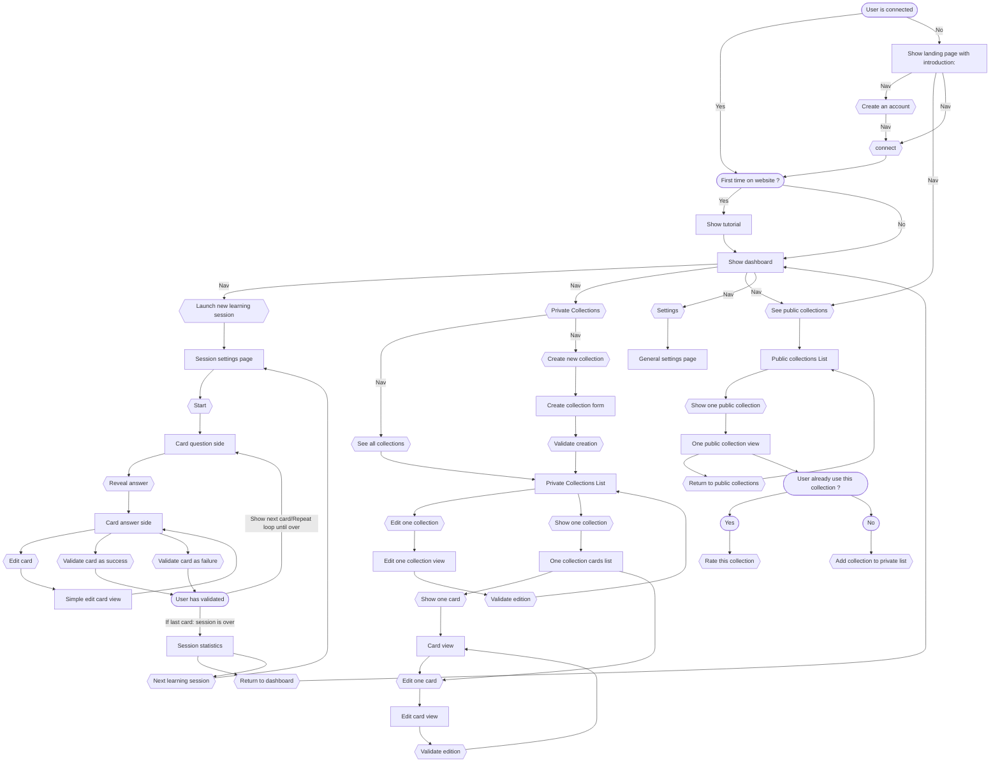

# Définition du projet
+ Les parties avec un ``??`` sont en attente d'être complétées
+ Les termes en gras correspondent aux termes officiels qui seront utilisés par l'application et devront donc être traduits également en anglais pour servir de références dans les BDD notamment

## Sommaire
1. [Compétences du référentiel validées par le projet](#1-compétences-du-référentiel-validées-par-le-projet)
2. [UX Design](#2-ux-design)
3. [Propositions de tests](#3-propositions-de-tests)
4. [Fonctionnement de la BDD](#4-fonctionnement-de-la-bdd)
5. [Technologies et outils utilisés](#5-technologies-et-outils-utilisés)
6. [Idées abandonnées et raisons de leur abandon](#6-les-idées-abandonnées-et-raisons-de-leur-abandon)

## 1. Compétences du référentiel validées par le projet:
REAC:  
Front: Développer la partie front-end d’une application web ou web mobile en intégrant les recommandations de sécurité:
1. ✔️Maquetter une application `obligatoire`
2. ✔️Réaliser une interface utilisateur web statique et adaptable `choix dev`
3. ✔️Développer une interface utilisateur web dynamique `choix dev`
4. ❌Réaliser une interface utilisateur avec une solution de gestion de contenu ou e-commerce `choix CMS`

Back: Développer la partie back-end d’une application web ou web mobile en intégrant les recommandations de sécurité:
1. ✔️Créer une base de données
2. ✔️Développer les composants d’accès aux données `obligatoire`
3. ✔️Développer la partie back-end d’une application web ou web mobile `choix dev`
4. ❌Elaborer et mettre en oeuvre des composants dans une application de gestion de contenu ou e-commerce `choix CMS`

## 2. UX Design

### 2.1 Objectifs généraux
+ L'objectif est de réaliser une application de **flashcards** maléable.
+ Les utilisateurs doivent pouvoir:
  - Créer leur propres flashcards
  - S'entrainer en utilisant leur flashcards ou celles de la communauté
  - Il doit donc y avoir possibilité de partager ses cartes avec la communauté
  - Avoir un aperçu de leur progression
### 2.2 Cas utilisateurs
On crée 3 personnas:
#### 2.2.1 Bob
Bob a 16ans, son professeur d'anglais lui a recommandé les flashcards pour apprendre du nouveau vocabulaire, il a regardé très rapidement le concept des flashcards mais n'est pas sûr de comprendre comment les utiliser.
+ Quelles sont ses attentes ?: 
  - Apprendre à utiliser les flashcards
  - Pouvoir les utiliser rapidement et simplement
+ Quelles sont ses freins potentielles ?:
  - L'utilisation des flashcards ne vient pas de son propre chef, il pourrait donc être plus rapidement frustré ou avoir envie d'abandonner
  - ``??``

#### 2.2.2 Phillipe-Adalbert Germain Du Plessix de l'Escarrère 
PA a 24 ans il est professeur et souhaiterait inciter ses élève à utiliser les flashcards, il voudrait pouvoir les créer lui même sous forme de cours progressifs.
+ Quelles sont ses attentes ?:
  - Pouvoir créer rapidement et facilement des flashcards
  - Pouvoir créer des collections de cartes organisées, avec des progressions différentes en fonction du niveau de ses élèves
  - Pouvoir partager les cartes créés avec ses classes 
  - Pouvoir créer les cartes autant depuis son pc de bureau que depuis son portable afin de pouvoir progresser autant depuis chez lui que dans les transports en commun en allant au travail
+ Quelles sont ses freins potentielles ?:
  - Si l'expérience utilisateur est trop différente entre son pc et son portable, il pourrait ne pas vouloir créer des cartes sur l'une des deux plateformes et donc avoir moins de temps pour préparer les flashcards pour ses élèves


#### 2.2.3 Gertrude
Gertrude a 37ans, elle ne cesse jamais d'apprendre, et est toujours à la recherche de nouveaux éléments à découvrir, néanmoins son emploi de chef dans un palace ne lui laisse que très peu de temps pour apprendre, elle connaît bien le principe des flashcards, récemment elle s'est mis à apprendre l'arabe.
+ Quelles sont ses attentes ?:
  - Pouvoir récupérer des collections de cartes préfaites pour les langages
  - Pouvoir créer ses propres cartes qu'elle pourra intégrer aux collections préfaites (par exemple pour des expressions locales ou d'argot qu'elle ne trouve pas dans les collections de la communauté)
+ Quelles sont ses freins potentielles ?:
  - Elle n'a que très peu de temps pour apprendre (quelques minutes pendant les repas)
  - Elle n'a donc pas vraiment de temps pour créer des cartes
  - Malgré son envie d'apprendre; le manque de temps et la difficulté d'apprendre une nouvelle langue pourrait la décourager, elle pourrait en effet assez rapidement croire qu'elle ne progresse pas


### 2.3 Conclusions de la recherche utilisateurs et réponses aux problèmes de base
En conclusion on cherche à:
  - Pouvoir créer des cartes de genres variés afin de s'adapter aux différents profils utilisateurs
  - Pouvoir comprendre le fonctionnement sans risque de se décourager, limiter au maximum la frustration
  - Pouvoir utiliser les cartes de manière rapide sans avoir des centaines de réglages à paramétrer au début et pouvoir ainsi lancer des sessions d'apprentissage n'importe où, n'importe quand
  - Pouvoir disposer quand même d'une certaine flexibilité quand aux utilisations qu'on pourra faire de ce site (cela doit donc faire partie de réglages additionnels qui ne doivent pas intérférer avec l'utilisation classique) 
  - Rendre le site ludique, pour inciter les utilisateurs qui n'ont de base pas de volonté d'apprendre de cette manière, mais y sont contraints par leur environnement, ou ceux qui manquent de temps et pourraient se décourager, à poursuivre leur apprentissage, pour cela on pourrait mettre en place un système de succès en plus des statistiques de cartes, les succès étant probablement plus amusants et entrainants que des stats brutes (puisqu'il est nécessaire d'aller voir nos stats et de les comprendres, alors qu'un succès montre rapidement et dans la continuité de l'utilisation classique qu'on a progressé dans un domaine) 

### 2.4 Mise en place des solutions et concepts généraux du site
+ [Fonctionnement des flashcards](#241-fonctionnement-des-flashcards)
+ [Les catégories et sous-catégories](#242-les-catégories-et-sous-catégories)
+ [Les collections](#243-les-collections)
+ [Les notes](#244-les-notes)
+ [Les rangs de cartes](#245-les-rangs)
+ [Les niveaux de difficulté des cartes](#246-les-niveaux-de-difficultés)
+ [La difficulté estimée des collections](#247-la-difficulté-estimée-des-collections)
+ [Les éléments de flashcards](#248-les-éléments-de-flashcards)
+ [Fonctionnement de la création/modification de carte](#249-fonctionnement-de-la-créationmodification-de-cartes)
+ [Les statistiques](#2410-les-statistiques-et-informations)
+ [Les succès](#2411-les-succès)
+ [La progression de l'utilisateur](#2412-la-progression-de-lutilisateur)
+ [Fonctionnement d'une session d'apprentissage](#2413-fonctionnement-général-dune-session-dapprentissage)
+ [Les paramètres de session](#2414-paramètres-de-session)
+ [Les paramètres généraux](#2415-paramètre-généraux)
+ [Signalement et réclamation](#2416-signalement-et-réclamation)
#### 2.4.1 Fonctionnement des flashcards
+ Les flashcards possèdent un **recto** et un **verso**
+ Sur chaque côté plusieurs éléments peuvent être affichés (ex: ``traduction + prononciation <=> mot étranger``)
+ Chaque carte doit avoir un **affichage par défaut** (c'est à dire spécifier ce qui s'affiche par défaut au recto et au verso)

#### 2.4.2 Les catégories et sous-catégories
Les **catégories**  correspondent à la taxonomie la plus élevée du site
+ Certaines sont crées dès le lancement du site
+ Les **catégories** et **sous-catégories** peuvent être ajoutées par les **utilisateurs** pour leurs propres **collections**
+ Il peut y avoir techniquement une infinité de sous-catégories néanmoins il faudra tenter de limiter à 2 générations de sous-catégories, l'objectif n'est pas de faire une classification réelle du savoir, mais d'avoir une classification générale afin de faciliter la navigation sur le site.
+ Par exemple, tenter de classer toutes les cartes liées aux langues en fonction des familles linguistiques, serait suicidaire; voir les [langues par famille sur Wikipédia](https://fr.wikipedia.org/wiki/Langues_par_famille)
+ De plus classer de manière trop scientifique, bien que plus exacte, risquerait d'être juste incompréhensible pour la majorité des gens, si on souhaite savoir ce qu'est la famille des langues Finno-Ougriennes alors il est plus pertinent d'apprendre une série de cartes sur les familles de langues, plutôt que d'observer les catégories
+ L'ajout de catégories et sous-catégories en version publique, devra faire l'objet d'une demande validée
+ Une carte ou une collection peut techniquement appartenir à plusieurs catégories, mais il est recommandé d'en utiliser qu'une seule
+ Les catégories (liste non exhaustive) avec des exemples de sous catégories:
  - Culture générale
  - Histoire
    - Moyen-Age Européen
    - Renaissance Italienne
    - Histoire des peuples Méso-américains
    - ...
  - Géographie
  - Langues
    - Linguistique
    - Français
    - Anglais
    - Japonais
    - Arabe
    - ...
  - Sciences
    - Mathématiques
    - Biologie
    - Chimie
    - ...
  - Politique
  - Justice & Droit
  - Economie
  - Santé
  - Sport
    - Sports collectifs
    - Sports individuels
  - Arts & Cultures
    - Musique
    - Littérature
    - Cinéma
    - Jeux-vidéos
    - Peinture
    - Sculpture

#### 2.4.3 Les collections
Les **collections** sont des groupes de cartes généralement liées à une même thématique, et pouvant appartenir à une ou plusieurs catégories
+ Il peut s'agir:
  - d'un groupement de cartes rassemblées par un utilisateur sur son **profil privé**
  - d'un groupement de cartes rassemblées par un utilisateur sur un **profil public** et donc accessible à la communauté
+ Seule les collections peuvent être partagées en profil public, les cartes isolées peuvent uniquement être créée de manière privée (il est de toute façon généralement conseillé de créer des collections plutôt que de laisser des cartes seules)
+ Une **collection publique** possède:
  - Un **auteur principal**:
    - qui a créé et nommé la collection
    - qui peut accepter ou non les demandes d'édition
    - qui peut accepter les ajouts d'auteurs secondaires
  - Des **auteurs secondaires**
+ Elle est définie par:
    - Un **nom**
    - une **description**
    - des éventuelles **sous-collections** (exemple pour une collection *Apprendre l'Arabe*, on pourrait avoir *1.1 Les bases*, *1.2 L'écriture*, ... )
    - Une **popularité** définie par le nombre de personnes qui ont choisi de l'utiliser
    - Une **note globale** définie par la moyenne des **notes** utilisateurs
    - Une **difficulté estimée** fixée par l'auteur principal
    - Une **langue**: dans quelle langue la carte a été rédigée (pour les **labels** des **éléments**)
    - Un **format** pour les libellés: la collection définit les libellés des éléments pour les cartes qu'elle contient
+ Lorsqu'on utilise une collection on peut choisir:
  - De l'utiliser telle quelle: on ne peut pas la modifier, mais si des cartes sont modifiées ou ajoutées par le créateur elles s'ajouteront à notre instance de la collection
  - De la privatiser: dans ce cas les cartes deviennent comme une de nos collections privée, on peut les modifier, les supprimer en ajouter, mais cela n'impacte pas la collection publique et on ne bénéficie pas des modifications de cette dernière
+ Une collection publique ne peut pas être complètement supprimée, si un auteur principal supprime son compte, alors le premier auteur secondaire devient le responsable pour la maintenance de la collection
+ Si un auteur estime que sa collection n'est plus pertinente, il peut alors la marquer comme étant **inactive**, dans ce cas un message d'avertissement sera affiché aux utilisateurs qui s'en servent lorsqu'il l'utiliseront. Une collection **inactive** ne peut plus être modifiée
+ Si une collection n'a plus aucun auteur actif, alors elle est aussi marquée **inactive**
+ Lors de la recherche des collections, il doit y avoir des filtres pour:
  - Choisir les catégories et sous-catégories
  - Choisir les auteurs
  - Choisir de classer par popularité et/ou par note
  - Choisir d'activer ou non les **collections** **inactives**  

#### 2.4.4 Les notes
+ Les cartes ne peuvent pas être notées individuellement
+ Seules les **collections publiques** peuvent être notées
+ Il faut avoir utilisé (en tant que collection publique ou privée) la collection de cartes qu'on note, un message supplémentaire s'affichera pour alerter l'utilisateur de ne noter la collection qu'après l'avoir suffisamment testée
+ Lors du processus de notation, il est demandé à l'utilisateur de répondre aux questions suivantes:
  - "Les informations sur les cartes ne contiennent pas d'erreur"
  - "Les cartes sont réalisées de manière lisible et agréable"
  - "Les cartes de cette collection sont efficaces et m'ont permis de progresser dans le domaine souhaité"
+ Les 3 questions précédentes peuvent chacune être répondu par 
  - ☆☆☆☆☆ Absolument pas d'accord
  - ★☆☆☆☆ Pas d'accord
  - ★★☆☆☆ Plutôt pas d'accord
  - ★★★☆☆ Plutôt d'accord
  - ★★★★☆ D'accord
  - ★★★★★ Complètement d'accord
+ Ensuite une moyenne des 3 notes est réalisée pour déterminer la note sur 5 de cet utilisateur, les notes de tous les utilisateurs sont réunies pour déterminer la note globale de la collection

#### 2.4.5 Les rangs
+ Les **rangs** sont un outil qui permet à l'utilisateur d'avoir un impact sur la manière dont les cartes lui sont présentées
+ Les cartes commencent toutes au **rang 1**
+ cela peut servir à:
  - laisser l'utilisateur définir la souplesse dans ses réponses: par exemple au rang 1 on peut ne connaitre qu'une partie de la réponse alors qu'un rang 5 nécessite la réponse complète et exacte (laissée à l'appréciation de l'utilisateur)
  > ex: pour du mandarin on pourrait avoir un rang de base `mot anglais` <-> `mot mandarin écrit/prononciation/Tons`, les cartes lorsqu'elles sont rangées au rang 1, peuvent etre considérées valides juste si on a le bon mot, peu importe le ton et l'écriture, au rang 2 il faudrait en plus être capable de connaitre le ton des mots, puis finalement de savoir l'écrire
  - cela permettrait sur des notions avancées, d'avoir une progression, la personne pourrait choisir de déjà maitriser les traductions, avant de se soucier des prononciations puis de l'écriture/orthographe correcte (puiqu'il faudrait qu'il sache en premier comment dire ce mot, avant de se soucier de la prononciation exacte ou de l'ortographe)
  - laisser l'utilisateur définir une progression différente pour les cartes, car il pourrait avoir réussi deux cartes dans une session, mais estimer qu'il maitrise largement mieux l'une que l'autre, les rangs lui permettent ainsi de déterminer quelles cartes il estime mieux maitriser
  > La carte la mieux maitrisée pourrait donc monter de rang et l'autre non
+ Les rangs peuvent être renommés par l'utilisateur afin qu'il puisse en cours de **session** se rappeler quel règle il s'impose pour la **validation** des cartes
+ Les noms des rangs ne sont modifiables qu'à l'échelle d'une collection
+ Chaque carte a une jauge allant de 1 à 5 et affichant aussi le nom du rang actuel (par défaut **rang 1**, **rang 2**,...)
+ Lors des sessions les rangs ne sont modifiables qu'après avoir révélé la réponse
+ Noms par défaut des rangs:
  - 1: Non maitrisée
  - 2: ``??``
  - 3: ``??``
  - 4: ``??``
  - 5: Maitrisée

#### 2.4.6 Les niveaux de difficultés
+ Le **niveau de difficulté** est un indicateur explicite du **taux de réussite moyen** d'une carte, il sert à classer les cartes selon 3 niveaux de difficulté (sujet à rééquilibrage):
  - **facile**: de 100% à 75% de taux de réussite (100% >= x >= 75%)
  - **moyen**: en dessous de 75% jusqu'à 25% non inclus de taux de réussite (75% > x > 25%)
  - **difficile**: de 0% à 25% de taux de réussite (25% >= x >= 0%) 
+ Toutes les cartes commencent avec un niveau de difficulté **moyen** par défaut
+ Dès qu'on s'auto-évalue pour la deuxième fois sur une carte, le niveau de difficulté est alors ré-établi en fonction du taux de réussite, puis le niveau de difficulté est ensuite recalculé à chaque auto-évaluation:
  - en effet si on a qu'un seul passage sur une carte, il n'y aurait donc que deux possibilités de taux de réussite (0% ou 100%), tandis qu'au bout de deux passage on aurrait alors 3 possibilités (0%, 50%, 100%), permettant alors d'établir un niveau de difficulté
+ Le niveau de difficulté d'une carte est bien entendu de plus en plus pertinent à mesure que l'utilisateur pratique (une carte faite 20 fois avec seulement 30% de taux de réussite, est clairement une carte difficile en revanche une carte faite uniquement 3 fois avec un taux de réussite de 33%, cela signifie simplement qu'on l'a réussi une fois et échoué deux fois, mais elle n'a pas été faite beaucoup de fois, donc peut etre que seulement deux essais de plus porterait son score à 80%) 
+ Si on fait une session de cartes de difficultés variées, c'est à dire quand on ne fait pas une session de carte basée sur une difficulté particulière, alors le niveau de diffculté doit s'afficher sur la carte ``-> il pourrait peut être aussi s'afficher quand il n'y a qu'une difficulté, afin d'indiquer le niveau à l'utilisateur??``

#### 2.4.7 La difficulté estimée des collections
La difficulté estimée d'une collection est fixée par son **créateur**/**auteur principal**, il s'agit d'une valeur arbitraire, il doit être précisé sur le site, que ce niveau de difficulté peut ne pas être représentatif de la difficulté réelle pour chaque personne

#### 2.4.8 Les éléments de flashcards
+ Une flashcard peut avoir différents **éléments** sur son recto et son verso (elle n'est pas limitée à un élément de chaque côté), ces éléments peuvent être de différents **types**:
  - Mot
  - Chaîne de caractères
  - Caractère (exemple caractère arabe, chinois, russe)
  - Image (Dessin/Photo/...)
  - QCM
+ Les cartes au sein d'une même collection ne peuvent avoir que maximum 4 éléments différents (exemple: ``prononciation, traduction, caractère, audio``)
+ Ces différents types doivent pouvoir permettre de créer de nombreuses combinaisons d'éléments sur les flashcards, exemple:
  - ``Mot <=> Description/image``
  - ``Image <=> Description``
  - ``Concept <=> Schéma`` (**advanced**:réalisable directment sur l'appli ?)
  - ``QCM <=> Réponse`` (pas vraiment d'intéret à laisser l'utilisateur choisir le sens d'apprentissage)
  - ``Caractère/Mot <=> Traduction + Prononciation``
+ A la création de cartes on peut donc choisir plusieurs éléments de chaque côté 
+ Quand on crée une collection on choisit au début le **format** des cartes, soit:
  - Avec des **formats** préfaits proposés par l'application: (ex: ``Caractère/Mot <=> Traduction + Prononciation``)
  - En créant soi même son **format** pour cette **collection**, le format ne peut avoir que 4 éléments, il faut choisir l'affichage par défaut de la collection (ex: element 1 et 3 au recto et 2 et 4 au verso), cet affichage par défaut servira lorsque l'utilisateur souhaite s'exercer avec plusieurs collections ou sous-collections en même temps, car dans ce cas si les formats ne sont pas identiques, il ne pourra avoir le choix qu'entre recto et verso et ne pourra pas choisir quel élément il met sur quel face pour cette session
+ Quand on enregistre la collection elle retient:
  - Un affichage par défaut (``Recto:Caractère/Mot <=> Verso:Traduction + Prononciation``): ce sera utilisé:
    - Quand on lance une session avec cette collection sans changer les paramètres
    - Quand on lance une session avec des collections mélangées qui ne possède pas le même **format** dans ce cas on ne pourra pas choisir quelles éléments on affiche sur quel côté, mais on aura tous les **recto** en question et les **verso** en réponse, ce qui permet de mélanger des cartes variées
  - L'ensemble des éléments sans emplacement particulier (``Caractère/Mot; Traduction; Prononciation``), ce qui permettra de sélectionner quels éléments on veut au **recto** et lesquels au **verso** tant qu'on utilise que des cartes du même **format**

#### 2.4.9 Fonctionnement de la création/modification de cartes
###### Création rapide
+ Si on crée des collections avec la **création rapide**:
  - On choisit le libellé de l'élément au **recto**
  - On choisit le libellé de l'élément au **verso**
  - On choisit les catégories/sous-catégories de la collection
  - Le rang est défini automatiquement à 1
  - On peut remplir en masse les cartes (par groupe de 10)
  - Les libellés qu'on a choisit formeront automatiquement un nouveau format
###### Création avancée
+ Si on crée des collections avec la **création avancée**:
  - On choisit le **format** d'affichage (soit grâce à un template préfait, soit en créant le sien), c'est à dire quels éléments existent sur les cartes et les libellés (il peut donc y en avoir plusieurs par côté)
  - On choisit l'affichage par défaut pour la collection (quels éléments pour le verso, lesquels pour le recto)
  - On choisit les catégories/sous-catégories de la collection
  - Une série de groupe de champs est alors affichée correspondant aux différents **éléments**,on peut les remplir carte par carte
  - Pour chaque carte le rang (défini automatiquement à 1 par défaut) peut être modifié, ainsi si en créant des cartes on sait déjà à quel point on estime les maitriser ou non alors on peut leur attribuer un rang supérieur à 1

###### Modification des collections
+ Quand une collection est créée on peut modifier:
  - le nom des libellés, 
  - l'affichage par défaut des éléments
  - ajouter un élément si on a pas déjà dépassé la limite de 4 (toutes les cartes déjà présentes dans cette collection retourneront donc ``null`` pour ce nouvel élément)
  - supprimer un élément: un message d'avertissement doit apparaitre pour prévenir l'utilisateur que toutes les données contenues pour cette élément dans les cartes déjà présentes seront supprimées définitivement
###### Ajout à une collection existante
+ Si on ajoute des cartes à une collection déjà existante:
  - Le **format** déjà existant nous est proposé pour les cartes qu'on souhaite ajouter
+ Il n'est pas possible de créer des cartes sans collection (en revanche on peut très bien créer une collection "divers" ou on ajoute tous les types de cartes qu'on veut)
###### Modification des cartes
+ Certains éléments des cartes peuvent être modifiés directement lors des sessions d'apprentissage, ces éléments ne sont modifiables qu'après la révélation de la carte, avant d'en valider le résultat (ce qui passe à la suivante) tels que:
  - Le rang des cartes modifiable avec la jauge
  - Le contenu d'un élément
  - ``??``
+ Pour le reste on peut aller voir les cartes dans la liste de cartes et les modifier

#### 2.4.10 Les statistiques et informations
Les cartes ont un ensemble de statistiques qui leur est propre (sauvegardé individuellement pour un utilisateur)
- **Taux de réussite moyen** de la carte (sur tous les passages)
- **Résultats des validations** qui permet de savoir le nombre de fois ou une carte est réussie d'affilé (ex: 00111110111: la carte a été échoué deux fois, avant d'être réussie 5 fois, puis un échec et 3 réussites )
- **Taux de réussite récent**: observe les 5 derniers résultats (identique au taux de réussite global si 5 passages ou moins)
- La **difficulté** de la carte (basée sur le **taux de réussite moyen**)
- Le **rang** actuel de la carte
- La **catégorie/sous-catégorie**
- Le **nombre de passage** sur la carte (un passage est compté après validation voir une carte sans la valider comme étant réussie ou échouée, ne compte pas)
- La **priorité d'apprentissage** de la carte


#### 2.4.11 Les succès
+ Peuvent être affichés sur notre profil ``??``
Idées de succès:
- Créer 1, 5, 10, 25, 50, 100, 1000 cartes
- Lire 1, 5, 10, 25, 50, 100, 1000, 5000, 100 000 cartes
- Maitriser 1, 5, 10, 25, 50, 100, 1000, 5000, 100 000 cartes (les cartes ont atteint le rang max)
- Partager 1, 5, 10, 25, 50, 100, 1000 cartes

#### 2.4.12 La progression de l'utilisateur
La progression de l'utilisateur sera indiqué par des graphiques basées sur les statistiques des cartes (rang de la carte, taux de réussite)
+ L'utilsateur a des statistiques globales:
  - **Taux de réussite global** de toutes les cartes (calculé à partir du taux de réussite moyen de chaque carte)
  - nombre total de cartes pratiquées
  - nombre de cartes pratiquées par jour

#### 2.4.13 Fonctionnement général d'une session d'apprentissage
+ L'utilisateur lance une session, des paramètres de base lui sont proposés:
  - basés sur les paramètres de base de l'application si c'est la première fois
  - ou basés sur ses précédents paramètres s'il en a
+ Il peux choisir de changer le type de cartes qui est proposé:
  - **générique** (DEFAUT): toutes les cartes qu'il a en stock, ne permet pas de choisir l'affichage des éléments
  - une **collection**
  - une **catégorie** ou **sous-catégorie**
  - toutes les cartes d'un **rang**
+ L'utilisateur valide lui même sa réponse, après la validation cela passe à l acarte suivante, c'est à lui d'estimer si sa réponse est correct ou non, ce choix est fait par rapport à une validation par l'application, pour:
  - Eviter à l'utilisateur d'avoir à taper chacune de ses réponses, ce qui lui ferait perdre du temps et créerait de la frustration, ainsi il a juste à choisir la validité de ses réponses
  - Eviter les frustrations liées à une réponse que l'appli juge invalide, mais que l'utilisateur considère comme assez maitrisée pour être considérée correcte
  - Suite à l'abandon de l'idée de compétition entre les utilisateurs (avec un tableau de score), cette validation par l'application n'est en réalité plus nécessaire
+ Il est possible de planifier des sessions d'apprentissage (exemple tous les mercredis à 13h avoir une notif de rappel pour une séance de cartes)
+ Lors d'une session les éléments d'une carte ne sont modifiables qu'après la révélation de la réponse juste avant la validation
+ Après être passé à la carte suivante on peut revenir en arrière pour voir une carte et remodifier des éléments (ex: changer le rang)
+ L'appli sélectionne les cartes en fonction du **taux de priorité**, il s'agit d'une valeur calculée en fonction:
  - du **rang**, 
  - du **nombre de passage**, 
  - du **taux de réussite moyen**/**difficulté**,
  - le **taux de priorité** permet de savoir au bout de combien de temps la carte doit être reproposée:
   - si une carte à un taux de réussite élevé, un rang élevé (indiquant que l'utilisateur ne la maitrise correctement) et un nombre de passage élevé, alors le taux de priorité sera faible, 
   - à l'inverse si la carte est souvent échouée , n'a que peu de fois été réalisée et si son rang est faible indiquant que l'utilisateur n'estime pas la maitriser correctement alors le taux de priorité sera élevé.

#### 2.4.14 Paramètres de session
Pour les paramètres de lancement d'une session:
+ On peut choisir de filtrer nos collections par catégorie, pour n'afficher que les collections disponible dans une catégorie particulière
+ On commence par déterminer quelle collection sera utilisée:
  - On peut choisir de lancer une collection, ou plusieurs collections
  - Si la session n'est pas éligible au changement d'affichage (collections de formats différents) on n'aura pas la possibilité de choisir quels éléments s'affichent sur quel côté et la configuration par défaut sera choisie pour toutes les cartes, on pourra en revanche choisir d'afficher le recto ou le verso
  - Si toutes les cartes ont le même **format** (une seule collection, ou toutes les collections ont la même checksum de format) alors on pourra choisir les éléments à afficher et leur disposition

+ Une fois ce choix de collection réalisé on peut choisir:
  - le niveau de difficulté des cartes (**tous**, **facile**, **moyen**, **difficile**)
  - le rang des cartes
  - le nombre de cartes
  - le côté de la carte à afficher (recto ou verso), si la collection est éligible au changement d'affichage on peut alors choisir quels éléments doivent être montrés au recto et lesquels au verso

#### 2.4.15 Paramètre généraux
+ Dans les options il faut pouvoir:
  - customiser l'aspect visuel des cartes:
    - couleurs d'arrière plan,
    - Taille de police,
    - couleur du texte,
    - disposition des éléments de réponses
+ Il est possible de modifier les **poids** du **taux de priorité**, afin de définir la fréquence à laquelle les cartes nous sont proposées:
  - poids du **nombre de passage ``??``** (auparavent appelé *timer*)
  - poids du **taux de réussite moyen**/**difficulté**
  - poids du **taux de réussite récent**
  - poids du **rang**
  - on peut aussi choisir de désactiver le rang et ainsi définir s'il influe ou non sur le taux
  - Attention: les poids des cartes ne seront pas modifiés tout de suite, ils ne seront modifiés qu'au prochain passage sur cette carte
+ Il est possible de modifier la portée du **taux de réussite récent**:
  - Par défaut il est à: **5 dernières cartes**
  - On peut choisir de modifier ce chiffre entre 3 et 10
+ Il est possible de choisir au bout de combien de temps une carte passe automatiquement au rang supérieur ou est rétrogradée au rang inférieur:
  - On peut choisir: 
    - augmentation de rang quand le taux de réussite récent est égal à 100% et diminution de rang quand le taux de réussite récent est inférieur ou égal à 25% (DEFAUT)
    - On peut modifier les deux curseurs avec des pourcentages
    - Note: le **classement automatique des rangs** (**ranking**) est du coup également impacté par la modification éventuelle du **taux de réussite récent**
  - On peut désactiver le **classement automatique des rangs**
  - Même quand le **classement automatique des rangs** est activée on peut modifier le rang manuellement pour chaque carte grâce à la jauge

#### 2.4.16 Signalement et réclamation
Créer un système de réclamation et de signalement:
+ si on s'aperçoit que des cartes ont un problème:
  - infos erronées, 
  - insultantes, 
  - pas dans la bonne catégorie
+ on peut alors:
  - en premier lieu contacter l'auteur de la carte s'il est toujours présent sur le site, pour signaler l'erreur
  - si ce n'est plus possible on peut alors les signaler, les cartes signalées seront traités par les modérateurs
  - Si les modérateurs estiment que le signalement est en partie valide, mais qu'il n'est pas du ressort du site de juger, alors la carte sera conservée, mais un avertissement sera ajouté (par exemple une affirmation scientifique controversée si elle est signalée, devra avoir un avertissement prévenant de la controverse)

### Le cheminement de l'utilisateur

#### Les comptes, rôles et autorisations
+ Si un utilisateur n'est pas connecté (**anonyme**) il peut:
  - Créer un compte
  - Observer les collections publiques
+ Les **utilisateurs** peuvent:
+ Les **modérateurs** peuvent:
  - Avoir les mêmes droits que les utilisateurs
  - S'occuper des cartes signalées par la communauté et juger de la probllématique qu'elles causent (la carte mérite-t-elle son signalement ?)
  - Il faudra mettre en place une charte de ce qui est accepté ou non sur le site, de façon à ce que les modérateurs puissent juger en ayant connaissance du règlement
  - Chaque décision de modérateur sera vérifiée par deux autres modérateurs afin de limiter les décisions injustes
+ L'**administrateur** peut:
+ Chaque utilisateur pourrait avoir la possibilité de créer un nombre limité (quand même assez élevé) de cartes, afin d'éviter de surcharger le serveur

#### Schéma explicatif du cheminement
- Dans une première phase, la version des collections publiques ne sera pas mise en place, (elle doit quand même être anticipée le plus possible pour le fonctionnement général), l'objectif est déjà de valider le fonctionnement des Flashcards à l'échelle individuelle
- Dans le schéma suivant, les rectangles à bord arrondis représentent les capacités ou le statut de l'utilisateur, les carrés représentent les vues, les hexagones représentent les liens de navigation

La vue de connection est la landing page, il y a:
- la page d'explication du concept
- une possibilité de créer un compte ou de se connecter


### Options avancées de l'application
Certaines options ne verront le jour qu'après qu'une version déjà pleinement fonctionnelle de l'application soit en état, c'est le cas de:
+ La possibilité de dessiner directement dans l'application pour la création des cartes, ce qui permettrait de réaliser soi même ses propres schémas, dessins, lettres,...; au lieu de les importer directement en format d'images
+ La possibilité de faire des dessins libres pendant les sessions d'apprentissage, ce afin de pouvoir par exemple, écrire des mots dans n'importe quel alphabet et testé notre connaissance de cette écriture, vérifier qu'on est capable de reproduire un schéma un peu complexe (car simplement essayer de le visualiser peut être trop compliqué pour des schémas trop complexes ou des alphabets difficiles):
  - Ces dessins pourraient être réalisées directement sur la carte, une zone de dessin s'afficherait en transparence par dessus, et on pourrait alors dessiner tout ce qu'on souhaite, à l'aide d'un outil type *canvas* comme sur *Skrible*
+ l'ajout de fichiers audio (ex: mot de langue étrangère), afin de créer des cartes de type ``audio <=> prononciation phonétique/description/traduction`` (ex: d'un coté un mot audio, de l'autre sa version écrite, afin de travailler sa prononciation)
+ S'il y a un portage en version application, la sauvegarde des cartes pourrait se faire sur la machine de l'utilisateur, il pourrait donc y avoir accès hors-ligne, et même exporter sa base de données de cartes
+ La possibilité d'imprimer nos flashcards en version papier
+ La possibilité d'importer un fichier JSON pour ajouter en masse des cartes, pour éviter les risques liés aux performances, cela pourrait uniquement être disponible à certaines personnes (compte payant ``??``), et/ou avec une limite au nombre ajoutable
+ Version payante pour avoir un nombre illimité de flashcard
+ Pouvoir se connecter avec un compte type réseau social ou google


### 2.5 UI
+ Réaliser un wireframe afin de déterminer la forme général du site en mobile puis en desktop, et définir les cheminements de l'utilisateur
+ Réaliser la maquette
+ Sommaire:
  - [2.5.1 Charte graphique](#251-charte-graphique)
  - [2.5.2 Liste des termes pour internationalisation](#252-liste-des-termes-en-anglais-et-français)
  - [2.5.3 Tutoriels et conseils d'utilisation](#253-tutoriels-et-conseils-dutilisation)
  - [2.5.4 Affichage d'une carte](#254-affichage-dune-carte)
#### 2.5.1 Charte graphique
+ Définir la charte graphique et l'identité du site:
  - Les couleurs: ``??``
  - Nom du site: ``??``
  - Slogan : ``??`` 
  - Le logo: Deux cartes se chevauchant, à leur jonction un changement de couleur symbolise en double sens la séparation entre les cartes ou un éclair
  - Les formes: ``??``
+ Pour les niveaux de difficultés: Quel logo ? Les étoiles étant déjà prises par les notes, des crânes ? Symbolique peut être trop jeu vidéo``?? -> pourquoi pas il y a bien des succès``
+ Les sessions doivent être facilement accessibles:
+ Au lancement on doit voir clairement :
  - Un bouton pour continuer la session en cours
  - un bouton pour lancer une nouvelle session
+ Quand on lance une nouvelle session:
  - des paramètres par défaut sont choisis, on a donc plus qu'à choisir une collection et lancer
  - si l'utilisateur a déjà lancé des sessions avant les paramètres précédents s'appliquent en guise de paramètres par défaut (y compris la collection précédente), il n'a donc plus qu' à lancer ou à modifier des paramètres
+ Le bouton pour relancer une session reprend simplement là où l'utilisateur était
+ Le menu est situé sur la gauche (un peu comme un dashboard)
+ Réaliser une page d'aides, qui regroupe:
  - Une introduction sur le principe des flashcards
  - Comment elles sont utilisées dans ce site
  - Les concepts de base liés à ce site, ainsi que les termes et leurs explications 
+ Le tutoriel doit:
  - Demander à l'utilisateur s'il souhaite réaliser le tutoriel, et préciser qu'il pourra être réalisé plus tard en allant dans les menus
  - Être simple et explicite (pas de fenêtre qui pop toutes les deux secondes), du genre un pas à pas qui prend en compte les grandes lignes, fait créer à l'utilisateur une petite collection de cartes, et lui fait ensuite utiliser
+ Pour la réalisation de la maquette on commmence par la partie mobile et on voit comment on peut l'adapter pour du desktop

#### 2.5.2 Liste des termes en Anglais et Français
- slug -> terme français: terme anglais
- card -> carte: card
- flashcard -> flashcard: flashcard
- collection -> collection: collection
- subcategory -> sous-catégorie: subcategory
- category -> catégorie: category
- default_display -> affichage par défaut: default display
- verso -> verso: verso
- recto -> recto: recto
- private_profile -> profil privé: private profile
- public_profile -> profil public: public profile
- public_collection -> collection publique: public collection
- private_collection -> collection privée: private collection
- creator -> créateur (d'une collection): creator
- main_author -> auteur principal: main author
- auxiliary_author -> auteur secondaire: auxiliary author
- collection_name -> nom de la collection: collection name
- collection_description -> description de la description: collection description
- subcollection -> sous-collections: subcollection
- popularity -> popularité: popularity
- global_rating -> note globale: global rating
- rating -> note: rating
- collection_difficulty -> difficulté estimée: estimated difficulty
- collection_language -> langue de la collection: collection language
- add -> ajouter: add
- delete -> supprimer: delete
- edit -> modifier: edit
- make_private -> rendre privé (une collection): make private
- collection_maintenance -> maintenance de la collection: collection maintenance
- inactive_collection -> inactive (collection): inactive collection
- active_collection -> active (collection): active collection
- rating_card_no_mistake_text -> "Les informations sur les cartes ne contiennent pas d'erreur": "Card informations does not contain any mistake"
- rating_card_relevant_text -> "Les informations sur les cartes sont pertinentes": "Card informations are relevant"
- rating_card_improve_text -> "Les cartes de cette collection sont efficaces et m'ont permis de progresser dans le domaine souhaité": "Cards in this collection are efficient and help me improve my knowledge in this field"
- rating_0 -> Absolument pas d'accord: Strongly disagree
- rating_1 -> Pas d'accord: Disagree
- rating_2 -> Plutôt pas d'accord: Rather disagree
- rating_3 -> Plutôt d'accord: Rather agree
- rating_4 -> D'accord: Agree
- rating_5 -> Complètement d'accord: Strongly agree
- card_rank -> rang: rank
- element_label -> libellé: label
- learning_session -> session d'apprentissage: learning session
- card_validation -> validation (des cartes): card validation
- ranking_gauge -> jauge (de rang): ranking gauge
- rank_label_1 -> non Maitrisée (rang 1 par défaut): not mastered
- rank_label_2 -> ``??`` (rang 2 par défaut): ``??``
- rank_label_3 -> ``??`` (rang 3 par défaut): ``??``
- rank_label_4 -> ``??`` (rang 4 par défaut): ``??``
- rank_label_5 -> maitrisée (rang 5 par défaut): mastered
- card_diffculty_level -> niveau de difficulté (d'une carte): difficulty level
- recent_success_rate -> taux de réussite récent: recent success rate
- average_success_rate -> taux de réussite moyen (anciennement global): average success rate
- global_success_rate -> taux de réussite global (anciennement moyen): global success rate
- difficulty_level -> Niveau de difficulté: Difficulty level
- difficulty_level_easy -> facile: easy 
- difficulty_level_medium -> moyen: medium 
- difficulty_level_hard -> difficile: hard
- difficulty_level_all -> tous (les niveaux de difficulté): all
- card_element -> élément (de flashcard): element
- card_element_type -> type (d'élément): type
- card_format -> format (de collection): format
- general_settings -> paramètres: settings
- session_settings -> paramètres de session d'apprentissage: learning session settings
- quick_creation -> création rapide: quick creation
- advanced_creation -> création avancée: advanced creation
- validation_result -> résultat des validations: validation result
- failure -> échec: failure
- success -> réussite: success
- priority_rate -> priorité d'apprentissage/taux de priorité: learning priority rate
- achievement -> succès: achievement
- progression -> progression: progression
- review_count -> nombre de passage (sur une carte): review count
- total_review_count -> nombre total de cartes pratiquées: total review count
- daily_review_count -> nombre de cartes pratiquées par jour: daily review count
- weight -> poids (du taux de priorité, du nombre de passage,...): weight
- {n}_last_cards -> 5 dernières cartes (paramètre du taux de réussite): 5 last reviewed cards
- auto_ranking -> classement automatique des rangs: auto-ranking
- problem_report -> signalement: report
- complaint -> réclamation: complaint
- user -> utilisateur: user
- logged_user -> utilisateur (connecté): (connected) user
- anonymous -> utilisateur anonyme (non connecté): anonymous user
- moderator -> modérateur: moderator
- administrator -> administrateur: administrator


#### 2.5.3 Tutoriels et conseils d'utilisation
+ Tâcher d'être le plus efficace possible, l'utilsateur ne doit pas être submergé de pavé de textes explicatifs:
  - Les boutons doivent être suffisamment explicite d'eux même
  - Les éléments de l'interface comme la jauge doivent être visuellment explicite sans prendre toute la place
  - S'il y a besoin d'une explication textuelle, en faire une version courte, avec éventuellement un lien vers un bloc d'aide plus long (si besoin)

#### 2.5.4 Affichage d'une carte
+ Quand on affiche une carte elle doit contenir visuellement:
  - Le contenu du verso (par défaut quand on est pas dans une session)
  - Le contenu du recto (par défaut quand on est pas dans une session)
  - un bouton d'édition (sauf si dans session et carte pas validée)
  - la difficulté de la carte
  - la jauge de rang avec le rang actuel

## 3. Propositions de tests

## 4. Fonctionnement de la BDD
Pour le stockage des cartes:
+ Quand une carte est sauvegardé on lui ajoute une checksum (pour l'instant il s'agit seulement des slug de labels de ses différents éléments, dans l'ordre alphabétique, voir s'il faudrait faire une vraie checksum ``??``)
+ On pourrait avoir une colonne avec des données de type array pour le contenu d'une carte, cela permettrait d'avoir une uniformité dans la notation (peut importe que la carte soit une carte simple avec un recto et un verso, ou un carte plus complexe avec plusieurs éléments par côté):
```json
{
  checksum: meaning_pronunciation_word,
  elements: [
    {
      slug: "meaning",
      label: "Meaning",
      content: "Hello",
      default: "verso"
    },
    {
      slug: "pronunciation",
      label: "Pronunciation",
      content: "bɔ̃ʒuʀ",
      default: "verso"
    },
    {
      slug: "word",
      label: "Word",
      content: "Bonjour",
      default: "recto"
    },
  ]
}
```


faire des schémas

## 5. Technologies et outils utilisés
- ***Figma*** pour le wireframe, et la maquette
- ***Gimp*** et ***Inkscape*** pour le logo et la retouche d'images
- ***Docker*** pour la conteneurisation
- ***i18next*** pour l'internationalisation ``??``
- Front: ***Vue.js***
- Back: 
  - ***Express.js*** pour le routing
  - ***Sequelize*** pour l'Object Relational Mapper (ORM)
  - ***ViteJs*** pour la compilation/minification
  - ``??`` pour la base de donnée

## 6. Les idées abandonnées et raisons de leur abandon
### Les familles
```markdown
Les familles d'apprentissage correspondent à la taxonomie la plus élevée du site
+ Il s'agit des grandes familles de connaissances qu'il peut y avoir
+ Elle sont créées au lancement du site
+ Elle ne peuvent pas être crées par la communauté
+ Des familles pourronts être rajoutées en fonction des retours
+ Une carte ne peut appartenir qu'à une seule famille
+ Les familles sont:
  - Culture générale
  - Histoire & Géographie
  - Langues
  - Sciences
  - Politique, Justice & Economie
  - Santé & Sport
  - Arts & Cultures
```
Les familles de cartes (voir aperçu ci-dessus) sont abandonnées, car:
- leur rôle est trop proche de celui des catégories
- Cela faisait donc un élément en plus en BDD qui n'était pas spécialement pertinent
- Elles étaient supposées être limitées et assez génériques pour être mutuellement exclusives (une carte n'aurait pu faire partie que d'une seule famille), ce qui oblige à faire des choix pour les noms des familles, ce qui aurait pu causer:
  - Des oublis de familles qui auraient pu être importantes
  - Des groupements arbitraires d'éléments au sein de familles (voir des opinions controversées)


### La compétition entre utilisateurs
L'idée de compétition entre utilisateurs est abandonnée pour:
- Eviter à l'utilisateur d'avoir rentrer une réponse manuellement (ce qui augmenterait inutilement le temps passé sur l'application, et les manipulations), il vaut mieux que l'utilisateur puisse penser mentallement ses réponses, donc l'application ne peut pas les controller, or une compétition basée sur l'honnêteté des réponses des utilisateurs, ne semblent pas pertinente (#euphémisme)
- L'objectif des flash cards est d'apprendre, pour son propre intérêt donc, et ajouter une compétition artificielle ne ferait que créer de la jalousie, de la frustration ou un sentiment d'infériorité vis à vis des personnes à haut score, enlevant ainsi une partie du côté ludique des flashcards
- Les succès personnels sont une meilleure façon d'inciter l'utilisateur à se dépasser lui même sans se comparer aux autres
- Certes *Brainscape* utilise un système de compétition intéressant et plutôt bien trouvé, puisqu'ils comparent le nombre de cartes étudiées et non pas le taux de réussite, mais une véritable absence de compétition me semble plus adaptée à mon projet, puisque l'objectif est d'avoir une grande diversité dans les types de flashcards, et donc une compétition n'aurait pas de sens, puisque tout le monde pourrait potentiellement avoir des cartes très différentes.

### Les possibilités de swiper pour valider ou non
```markdown
- tap affiche une card
- swipe haut : affiche le menu de la carte ?
- swipe bas si ne sait pas, tap again affiche la reponse,
- swipe left false,
- swipe right true
- menu sur la gauche en desktop
- Pour des raisons d'accessibilité attention avec les swaps, ils doivent pouvoir etre utilisé par un controle à la voix ? si ça marche comme ça ? à voir
``` 
Les options de swipe (voir aperçu ci-dessus) qui étaient prévues au début du projet, bien qu'intéressantes visuellement sont abandonnées car:
+ C'est visuel justement, et donc pose des problème d'accessibilité, les lecteurs d'écran sont apparemment capables de prendre en compte les actions correspondant à des *swipes* sur la droite ou la gauche, mais le projet nécessitait de modifier ces actions (donc risque d'interférence avec un comportement natif)
+ Il s'agit d'éléments compliqués à implémenter, or ils devront du coup être désactivés ou doublés d'une option plus classique de type clic sur un bouton, il est donc peu intéressant d'investir autant de temps dans des actions qui ne seront valide que dans certains cas, en effet il faudrait les désactiver pour: 
  - Le mode desktop (ou le remplacer par l'utilisation des flches du clavier)
  - Pour l'accessibilité (ou en tout cas doubler d'une autre option)
  - De plus certaines personnes même si elles n'utilisent pas les lecteurs d'écran pourrait avoir des difficultés à comprendre si le fonctionnment n'est pas *classique* (comme un bouton)
  - Il faudrait que j'ajoute exprès des éléments tutoriels pour expliquer ou il faut swiper pour telle ou telle action, alors qu'il serait plus simple d'avoir des boutons, clairs et explicites qui ne nécessite pas de double explications
+ Ainsi on gagne en uniformité sur le projet

### La conception automatique de flashcards
+ Bien qu'il aurait été intéressant de pouvoir avoir des séries de règles afin de créer des cartes de manière semi-automatique:  
  - par exemple un professeur qui souhaiterais entrainer ses élèves aux tables de multiplication pourrait sélectionner une série de nombres un opérateur et un multiplicateur et générer automatiquement toutes les cartes qu'il souhaite (par exemple pour la table du 12)
  - Cela poserait des problème de performances voire pourrait crasher le site, puisqu'il serait extrêmement simple de créer une règle pour avoir une infinité de cartes
  - Cela nécessiterais donc trop de barrières pour être fiable, même avec une limite au nombre de cartes générables de cette manière, il serait quand même possible de créer des cartes à un rythme trop rapide pour que ce soit sécurisé
  - De plus ce serait dangereux, puisqu'il serait peut etre possible à l'utilisateur de détourner le système pour exécuter du code malveillant, ou alors limiter à seulement un petit nombres de règles aisément maitrisables, mais il n'y aurait alors probablment plus beaucoup d'intérêt 

### Le temps chronométré
+ Un des problèmes auquel on souhaite répondre est le manque de temps de l'utilisateur, lui apporter une pression de temps supplémentaire n'apporterait rien de positif

