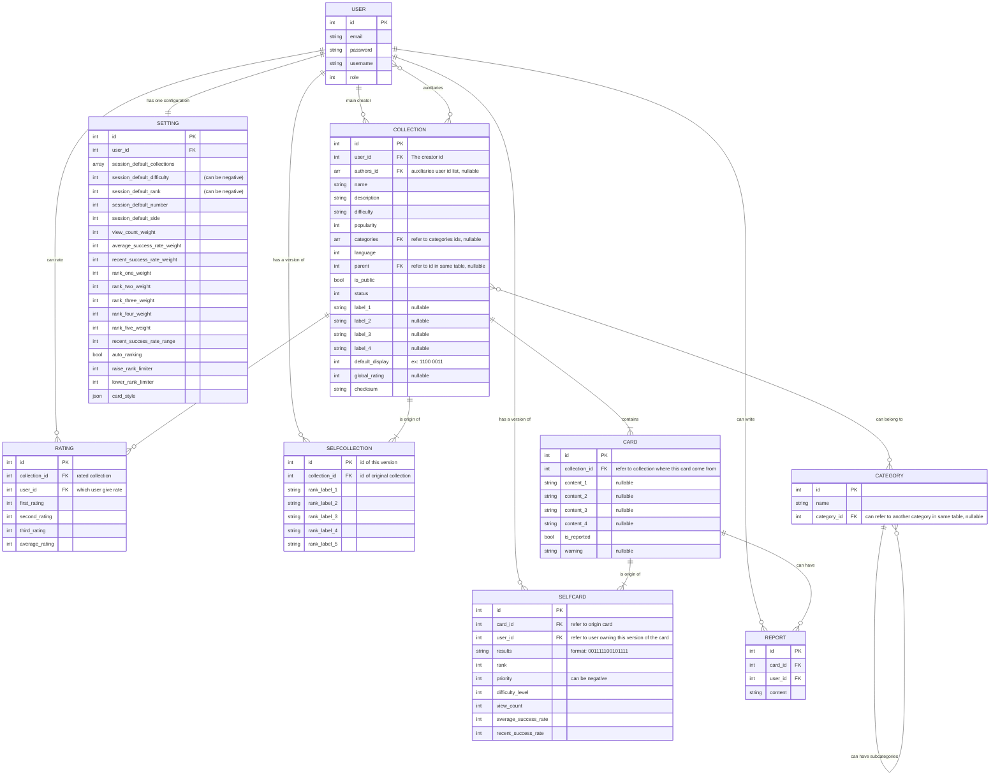

# Définition du projet
+ Les parties avec un ``??`` sont en attente d'être complétées
+ Les termes en gras correspondent aux termes officiels qui seront utilisés par l'application et devront donc être traduits également en anglais pour servir de références dans les BDD notamment

## Sommaire
1. [Compétences du référentiel validées par le projet](#1-compétences-du-référentiel-validées-par-le-projet)
2. [UX Design](#2-ux-design)
3. [Propositions de tests](#3-propositions-de-tests)
4. [Fonctionnement de la BDD](#4-fonctionnement-de-la-bdd)
5. [Technologies et outils utilisés](#5-technologies-et-outils-utilisés)
6. [Idées abandonnées et raisons de leur abandon](#6-les-idées-abandonnées-et-raisons-de-leur-abandon)

## 1. Compétences du référentiel validées par le projet:
REAC:  
Front: Développer la partie front-end d’une application web ou web mobile en intégrant les recommandations de sécurité:
1. ✔️Maquetter une application `obligatoire`
2. ✔️Réaliser une interface utilisateur web statique et adaptable `choix dev`
3. ✔️Développer une interface utilisateur web dynamique `choix dev`
4. ❌Réaliser une interface utilisateur avec une solution de gestion de contenu ou e-commerce `choix CMS`

Back: Développer la partie back-end d’une application web ou web mobile en intégrant les recommandations de sécurité:
1. ✔️Créer une base de données
2. ✔️Développer les composants d’accès aux données `obligatoire`
3. ✔️Développer la partie back-end d’une application web ou web mobile `choix dev`
4. ❌Elaborer et mettre en oeuvre des composants dans une application de gestion de contenu ou e-commerce `choix CMS`

## 2. UX Design

### 2.1 Objectifs généraux
+ L'objectif est de réaliser une application de **flashcards** maléable.
+ Les utilisateurs doivent pouvoir:
  - Créer leur propres flashcards
  - S'entrainer en utilisant leur flashcards ou celles de la communauté
  - Il doit donc y avoir possibilité de partager ses cartes avec la communauté
  - Avoir un aperçu de leur progression
### 2.2 Cas utilisateurs
On crée 3 personnas:
#### 2.2.1 Bob
Bob a 16ans, son professeur d'anglais lui a recommandé les flashcards pour apprendre du nouveau vocabulaire, il a regardé très rapidement le concept des flashcards mais n'est pas sûr de comprendre comment les utiliser.
+ Quelles sont ses attentes ?: 
  - Apprendre à utiliser les flashcards
  - Pouvoir les utiliser rapidement et simplement
+ Quelles sont ses freins potentielles ?:
  - L'utilisation des flashcards ne vient pas de son propre chef, il pourrait donc être plus rapidement frustré ou avoir envie d'abandonner
  - ``??``

#### 2.2.2 Phillipe-Adalbert Germain Du Plessix de l'Escarrère 
PA a 24 ans il est professeur et souhaiterait inciter ses élève à utiliser les flashcards, il voudrait pouvoir les créer lui même sous forme de cours progressifs.
+ Quelles sont ses attentes ?:
  - Pouvoir créer rapidement et facilement des flashcards
  - Pouvoir créer des collections de cartes organisées, avec des progressions différentes en fonction du niveau de ses élèves
  - Pouvoir partager les cartes créés avec ses classes 
  - Pouvoir créer les cartes autant depuis son pc de bureau que depuis son portable afin de pouvoir progresser autant depuis chez lui que dans les transports en commun en allant au travail
+ Quelles sont ses freins potentielles ?:
  - Si l'expérience utilisateur est trop différente entre son pc et son portable, il pourrait ne pas vouloir créer des cartes sur l'une des deux plateformes et donc avoir moins de temps pour préparer les flashcards pour ses élèves


#### 2.2.3 Gertrude
Gertrude a 37ans, elle ne cesse jamais d'apprendre, et est toujours à la recherche de nouveaux éléments à découvrir, néanmoins son emploi de chef dans un palace ne lui laisse que très peu de temps pour apprendre, elle connaît bien le principe des flashcards, récemment elle s'est mis à apprendre l'arabe.
+ Quelles sont ses attentes ?:
  - Pouvoir récupérer des collections de cartes préfaites pour les langages
  - Pouvoir créer ses propres cartes qu'elle pourra intégrer aux collections préfaites (par exemple pour des expressions locales ou d'argot qu'elle ne trouve pas dans les collections de la communauté)
+ Quelles sont ses freins potentielles ?:
  - Elle n'a que très peu de temps pour apprendre (quelques minutes pendant les repas)
  - Elle n'a donc pas vraiment de temps pour créer des cartes
  - Malgré son envie d'apprendre; le manque de temps et la difficulté d'apprendre une nouvelle langue pourrait la décourager, elle pourrait en effet assez rapidement croire qu'elle ne progresse pas


### 2.3 Conclusions de la recherche utilisateurs et réponses aux problèmes de base
En conclusion on cherche à:
  - Pouvoir créer des cartes de genres variés afin de s'adapter aux différents profils utilisateurs
  - Pouvoir comprendre le fonctionnement sans risque de se décourager, limiter au maximum la frustration
  - Pouvoir utiliser les cartes de manière rapide sans avoir des centaines de réglages à paramétrer au début et pouvoir ainsi lancer des sessions d'apprentissage n'importe où, n'importe quand
  - Pouvoir disposer quand même d'une certaine flexibilité quand aux utilisations qu'on pourra faire de ce site (cela doit donc faire partie de réglages additionnels qui ne doivent pas intérférer avec l'utilisation classique) 
  - Rendre le site ludique, pour inciter les utilisateurs qui n'ont de base pas de volonté d'apprendre de cette manière, mais y sont contraints par leur environnement, ou ceux qui manquent de temps et pourraient se décourager, à poursuivre leur apprentissage, pour cela on pourrait mettre en place un système de succès en plus des statistiques de cartes, les succès étant probablement plus amusants et entrainants que des stats brutes (puisqu'il est nécessaire d'aller voir nos stats et de les comprendres, alors qu'un succès montre rapidement et dans la continuité de l'utilisation classique qu'on a progressé dans un domaine) 

### 2.4 Mise en place des solutions et concepts généraux du site
+ [Fonctionnement des flashcards](#241-fonctionnement-des-flashcards)
+ [Les catégories et sous-catégories](#242-les-catégories-et-sous-catégories)
+ [Les collections](#243-les-collections)
+ [Les notes](#244-les-notes)
+ [Les rangs de cartes](#245-les-rangs)
+ [Les niveaux de difficulté des cartes](#246-les-niveaux-de-difficultés)
+ [La difficulté estimée des collections](#247-la-difficulté-estimée-des-collections)
+ [Les éléments de flashcards](#248-les-éléments-de-flashcards)
+ [Fonctionnement de la création/modification de carte](#249-fonctionnement-de-la-créationmodification-de-cartes)
+ [Les statistiques](#2410-les-statistiques-et-informations)
+ [Les succès](#2411-les-succès)
+ [La progression de l'utilisateur](#2412-la-progression-de-lutilisateur)
+ [Fonctionnement d'une session d'apprentissage](#2413-fonctionnement-général-dune-session-dapprentissage)
+ [Les paramètres de session](#2414-paramètres-de-session)
+ [Les paramètres généraux](#2415-paramètre-généraux)
+ [Signalement et réclamation](#2416-signalement-et-réclamation)
#### 2.4.1 Fonctionnement des flashcards
+ Les flashcards possèdent un **recto** et un **verso**
+ Sur chaque côté plusieurs éléments peuvent être affichés (ex: ``traduction + prononciation <=> mot étranger``)
+ Chaque carte doit avoir un **affichage par défaut** (c'est à dire spécifier ce qui s'affiche par défaut au recto et au verso)

#### 2.4.2 Les catégories et sous-catégories
Les **catégories**  correspondent à la taxonomie la plus élevée du site
+ Certaines sont crées dès le lancement du site
+ Les **catégories** et **sous-catégories** sont à l'échelle publique (il est possible d'utiliser les catégories existantes pour nos collections privées)
+ Il peut y avoir techniquement une infinité de sous-catégories néanmoins il faudra tenter de limiter à 2 générations de sous-catégories, l'objectif n'est pas de faire une classification réelle du savoir, mais d'avoir une classification générale afin de faciliter la navigation sur le site.
+ Par exemple, tenter de classer toutes les cartes liées aux langues en fonction des familles linguistiques, serait suicidaire; voir les [langues par famille sur Wikipédia](https://fr.wikipedia.org/wiki/Langues_par_famille)
+ De plus classer de manière trop scientifique, bien que plus exacte, risquerait d'être juste incompréhensible pour la majorité des gens, si on souhaite savoir ce qu'est la famille des langues Finno-Ougriennes alors il est plus pertinent d'apprendre une série de cartes sur les familles de langues, plutôt que d'observer les catégories
+ L'ajout de catégories et sous-catégories en version publique, devra faire l'objet d'une demande validée ***(Phase II)***
+ Une carte ou une collection peut techniquement appartenir à plusieurs catégories, mais il est recommandé d'en utiliser qu'une seule
+ Les catégories (liste non exhaustive) avec des exemples de sous catégories:
  - Culture générale
  - Histoire
    - Moyen-Age Européen
    - Renaissance Italienne
    - Histoire des peuples Méso-américains
    - ...
  - Géographie
  - Langues
    - Linguistique
    - Français
    - Anglais
    - Japonais
    - Arabe
    - ...
  - Sciences
    - Mathématiques
    - Biologie
    - Chimie
    - ...
  - Politique
  - Justice & Droit
  - Economie
  - Santé
  - Sport
    - Sports collectifs
    - Sports individuels
  - Arts & Cultures
    - Musique
    - Littérature
    - Cinéma
    - Jeux-vidéos
    - Peinture
    - Sculpture

#### 2.4.3 Les collections
Les **collections** sont des groupes de cartes généralement liées à une même thématique, et pouvant appartenir à une ou plusieurs catégories
+ Il peut s'agir:
  - d'un groupement de cartes rassemblées par un utilisateur sur son **profil privé**
  - d'un groupement de cartes rassemblées par un utilisateur sur un **profil public** et donc accessible à la communauté
+ Une **collection publique** possède:
  - Un **auteur principal**:
    - qui a créé et nommé la collection
    - qui peut accepter ou non les demandes d'édition
    - qui peut accepter les ajouts d'auteurs secondaires
  - Des **auteurs secondaires**
+ Elle est définie par:
    - Un **nom**
    - une **description**
    - des éventuelles **sous-collections** (exemple pour une collection *Apprendre l'Arabe*, on pourrait avoir *1.1 Les bases*, *1.2 L'écriture*, ... )
    - Une **popularité** définie par le nombre de personnes qui ont choisi de l'utiliser
    - Une **note globale** définie par la moyenne des **notes** utilisateurs
    - Une **difficulté estimée** fixée par l'auteur principal
    - Une **langue**: dans quelle langue la carte a été rédigée (pour les **labels** des **éléments**), la langue pourra faire partie des filtres de recherche pour les collections publiques
    - Un **format** pour les libellés: la collection définit les libellés des éléments pour les cartes qu'elle contient
+ Lorsqu'on utilise une collection on peut choisir:
  - De l'utiliser telle quelle: on ne peut pas la modifier, mais si des cartes sont modifiées ou ajoutées par le créateur elles s'ajouteront à notre instance de la collection
  - De la privatiser: dans ce cas les cartes deviennent comme une de nos collections privée, on peut les modifier, les supprimer en ajouter, mais cela n'impacte pas la collection publique et on ne bénéficie pas des modifications de cette dernière
+ Une collection publique ne peut pas être complètement supprimée, si un auteur principal supprime son compte, alors le premier auteur secondaire devient le responsable pour la maintenance de la collection
+ Si un auteur estime que sa collection n'est plus pertinente, il peut alors la marquer comme étant **inactive**, dans ce cas un message d'avertissement sera affiché aux utilisateurs qui s'en servent lorsqu'il l'utiliseront. Une collection **inactive** ne peut plus être modifiée
+ Si une collection n'a plus aucun auteur actif, alors elle est aussi marquée **inactive**
+ Lors de la recherche des collections, il doit y avoir des filtres pour:
  - Choisir les catégories et sous-catégories
  - Choisir les auteurs
  - Choisir de classer par popularité et/ou par note
  - Choisir d'activer ou non les **collections** **inactives** 
  - Choisir la langue des labels: devrait donc être un champ select select avec tous les langages habituels dans les applis

#### 2.4.4 Les notes
+ Les cartes ne peuvent pas être notées individuellement
+ Seules les **collections publiques** peuvent être notées
+ Il faut avoir utilisé (en tant que collection publique ou privée) la collection de cartes qu'on note, un message supplémentaire s'affichera pour alerter l'utilisateur de ne noter la collection qu'après l'avoir suffisamment testée
+ Lors du processus de notation, il est demandé à l'utilisateur de répondre aux questions suivantes:
  - "Les informations sur les cartes ne contiennent pas d'erreur"
  - "Les cartes sont réalisées de manière lisible et agréable"
  - "Les cartes de cette collection sont efficaces et m'ont permis de progresser dans le domaine souhaité"
+ Les 3 questions précédentes peuvent chacune être répondu par 
  - ☆☆☆☆☆ Absolument pas d'accord
  - ★☆☆☆☆ Pas d'accord
  - ★★☆☆☆ Plutôt pas d'accord
  - ★★★☆☆ Plutôt d'accord
  - ★★★★☆ D'accord
  - ★★★★★ Complètement d'accord
+ Ensuite une moyenne des 3 notes est réalisée pour déterminer la note sur 5 de cet utilisateur, les notes de tous les utilisateurs sont réunies pour déterminer la note globale de la collection

#### 2.4.5 Les rangs
+ Les **rangs** sont un outil qui permet à l'utilisateur d'avoir un impact sur la manière dont les cartes lui sont présentées
+ Les cartes commencent toutes au **rang 1**
+ cela peut servir à:
  - laisser l'utilisateur définir la souplesse dans ses réponses: par exemple au rang 1 on peut ne connaitre qu'une partie de la réponse alors qu'un rang 5 nécessite la réponse complète et exacte (laissée à l'appréciation de l'utilisateur)
  > ex: pour du mandarin on pourrait avoir un rang de base `mot anglais` <-> `mot mandarin écrit/prononciation/Tons`, les cartes lorsqu'elles sont rangées au rang 1, peuvent etre considérées valides juste si on a le bon mot, peu importe le ton et l'écriture, au rang 2 il faudrait en plus être capable de connaitre le ton des mots, puis finalement de savoir l'écrire
  - cela permettrait sur des notions avancées, d'avoir une progression, la personne pourrait choisir de déjà maitriser les traductions, avant de se soucier des prononciations puis de l'écriture/orthographe correcte (puiqu'il faudrait qu'il sache en premier comment dire ce mot, avant de se soucier de la prononciation exacte ou de l'ortographe)
  - laisser l'utilisateur définir une progression différente pour les cartes, car il pourrait avoir réussi deux cartes dans une session, mais estimer qu'il maitrise largement mieux l'une que l'autre, les rangs lui permettent ainsi de déterminer quelles cartes il estime mieux maitriser
  > La carte la mieux maitrisée pourrait donc monter de rang et l'autre non
+ Les rangs peuvent être renommés par l'utilisateur afin qu'il puisse en cours de **session** se rappeler quel règle il s'impose pour la **validation** des cartes
+ Les noms des rangs ne sont modifiables qu'à l'échelle d'une collection
+ Chaque carte a une jauge allant de 1 à 5 et affichant aussi le nom du rang actuel
+ Lors des sessions les rangs ne sont modifiables qu'après avoir révélé la réponse
+ Noms par défaut des rangs:
  - 1: Non maitrisée
  - 2: ``Rang 2??``
  - 3: ``Rang 3??``
  - 4: ``Rang 4??``
  - 5: Maitrisée

#### 2.4.6 Les niveaux de difficultés
+ Le **niveau de difficulté** est un indicateur explicite du **taux de réussite moyen** d'une carte, il sert à classer les cartes selon 3 niveaux de difficulté (sujet à rééquilibrage):
  - **facile**: de 100% à 75% de taux de réussite (100% >= x >= 75%)
  - **moyen**: en dessous de 75% jusqu'à 25% non inclus de taux de réussite (75% > x > 25%)
  - **difficile**: de 0% à 25% de taux de réussite (25% >= x >= 0%) 
+ Toutes les cartes commencent avec un niveau de difficulté **moyen** par défaut
+ Dès qu'on s'auto-évalue pour la deuxième fois sur une carte, le niveau de difficulté est alors ré-établi en fonction du taux de réussite, puis le niveau de difficulté est ensuite recalculé à chaque auto-évaluation:
  - en effet si on a qu'un seul passage sur une carte, il n'y aurait donc que deux possibilités de taux de réussite (0% ou 100%), tandis qu'au bout de deux passage on aurrait alors 3 possibilités (0%, 50%, 100%), permettant alors d'établir un niveau de difficulté
+ Le niveau de difficulté d'une carte est bien entendu de plus en plus pertinent à mesure que l'utilisateur pratique (une carte faite 20 fois avec seulement 30% de taux de réussite, est clairement une carte difficile en revanche une carte faite uniquement 3 fois avec un taux de réussite de 33%, cela signifie simplement qu'on l'a réussi une fois et échoué deux fois, mais elle n'a pas été faite beaucoup de fois, donc peut etre que seulement deux essais de plus porterait son score à 80%) 
+ Si on fait une session de cartes de difficultés variées, c'est à dire quand on ne fait pas une session de carte basée sur une difficulté particulière, alors le niveau de diffculté doit s'afficher sur la carte ``-> il pourrait peut être aussi s'afficher quand il n'y a qu'une difficulté, afin d'indiquer le niveau à l'utilisateur??``

#### 2.4.7 La difficulté estimée des collections
La difficulté estimée d'une collection est fixée par son **créateur**/**auteur principal**, il s'agit d'une valeur arbitraire, il doit être précisé sur le site, que ce niveau de difficulté peut ne pas être représentatif de la difficulté réelle pour chaque personne

#### 2.4.8 Les éléments de flashcards
+ Une flashcard peut avoir différents **éléments** sur son recto et son verso (elle n'est pas limitée à un élément de chaque côté), ces éléments peuvent être de différents **types**:
  - Mot
  - Chaîne de caractères
  - Caractère (exemple caractère arabe, chinois, russe)
  - Image (Dessin/Photo/...)
  - QCM
+ Les cartes au sein d'une même collection ne peuvent avoir que maximum 4 éléments différents (exemple: ``prononciation, traduction, caractère, audio``)
+ Ces différents types doivent pouvoir permettre de créer de nombreuses combinaisons d'éléments sur les flashcards, exemple:
  - ``Mot <=> Description/image``
  - ``Image <=> Description``
  - ``Concept <=> Schéma`` (**advanced**:réalisable directment sur l'appli ?)
  - ``QCM <=> Réponse`` (pas vraiment d'intéret à laisser l'utilisateur choisir le sens d'apprentissage)
  - ``Caractère/Mot <=> Traduction + Prononciation``
+ A la création de cartes on peut donc choisir plusieurs éléments de chaque côté 
+ Quand on crée une collection on choisit au début le **format** des cartes, soit:
  - Avec des **formats** préfaits proposés par l'application: (ex: ``Caractère/Mot <=> Traduction + Prononciation``)
  - En créant soi même son **format** pour cette **collection**, le format ne peut avoir que 4 éléments, il faut choisir l'affichage par défaut de la collection (ex: element 1 et 3 au recto et 2 et 4 au verso), cet affichage par défaut servira lorsque l'utilisateur souhaite s'exercer avec plusieurs collections ou sous-collections en même temps, car dans ce cas si les formats ne sont pas identiques, il ne pourra avoir le choix qu'entre recto et verso et ne pourra pas choisir quel élément il met sur quel face pour cette session
+ Quand on enregistre la collection elle retient:
  - Un affichage par défaut (``Recto:Caractère/Mot <=> Verso:Traduction + Prononciation``): ce sera utilisé:
    - Quand on lance une session avec cette collection sans changer les paramètres
    - Quand on lance une session avec des collections mélangées qui ne possède pas le même **format** dans ce cas on ne pourra pas choisir quelles éléments on affiche sur quel côté, mais on aura tous les **recto** en question et les **verso** en réponse, ce qui permet de mélanger des cartes variées
  - L'ensemble des éléments sans emplacement particulier (``Caractère/Mot; Traduction; Prononciation``), ce qui permettra de sélectionner quels éléments on veut au **recto** et lesquels au **verso** tant qu'on utilise que des cartes du même **format**

#### 2.4.9 Fonctionnement de la création/modification de cartes
###### Création rapide
+ Si on crée des collections avec la **création rapide**:
  - On choisit le libellé de l'élément au **recto**
  - On choisit le libellé de l'élément au **verso**
  - On choisit les catégories/sous-catégories de la collection
  - Le rang est défini automatiquement à 1
  - On peut remplir en masse les cartes (par groupe de 10): il y a un groupe de champs avec le libellé qu'on vient de créer et un champ pour entrer nos valeurs
  - Les libellés qu'on a choisit formeront automatiquement un nouveau format
###### Création avancée
+ Il s'agit d'un bouton qui permet d'afficher plus de choix de personalisation
+ Si on crée des collections avec la **création avancée**:
  - On choisit le **format** d'affichage (soit grâce à un template préfait, soit en créant le sien), c'est à dire quels éléments existent sur les cartes et les libellés (il peut donc y en avoir plusieurs par côté)
  - On choisit l'affichage par défaut pour la collection (quels éléments pour le verso, lesquels pour le recto)
  - On choisit les catégories/sous-catégories de la collection
  - Une série de groupe de champs est alors affichée correspondant aux différents **éléments**,on peut les remplir carte par carte
  - On peut choisir de rendre public avec un champ à cocher ``rendre public ``
  - Si rendre public est coché: un champ permettant d'indiquer la langue utilisée pour les descriptions et les labels (défaut: anglais) s'affiche
  - Pour chaque carte le rang (défini automatiquement à 1 par défaut) peut être modifié, ainsi si en créant des cartes on sait déjà à quel point on estime les maitriser ou non alors on peut leur attribuer un rang supérieur à 1
  - Pour le remplissage de masse on a 10 groupes de champs avec à chaque fois les 4 champs pour les éléments 1,2,3,4 (ou moins si on a choisit moins d'éléments), + un champ curseur avec 1 en valeur par défaut pour le rang, qu'on peut alors changer

###### Modification des collections
+ Quand une collection est créée on peut modifier:
  - le nom des libellés, 
  - l'affichage par défaut des éléments
  - ajouter un élément si on a pas déjà dépassé la limite de 4 (toutes les cartes déjà présentes dans cette collection retourneront donc ``null`` pour ce nouvel élément)
  - supprimer un élément: un message d'avertissement doit apparaitre pour prévenir l'utilisateur que toutes les données contenues pour cette élément dans les cartes déjà présentes seront supprimées définitivement
  - Il n'est pas possible de passer une collection publique complètement en privée, on peut en revanche ajouter notre collection publique à notre répertoire de collections privées comme n'importe quel utilisateur.
###### Ajout à une collection existante
+ Si on ajoute des cartes à une collection déjà existante:
  - Le **format** déjà existant nous est proposé pour les cartes qu'on souhaite ajouter
+ Il n'est pas possible de créer des cartes sans collection (en revanche on peut très bien créer une collection "divers" ou on ajoute tous les types de cartes qu'on veut)
###### Modification des cartes
+ Certains éléments des cartes peuvent être modifiés directement lors des sessions d'apprentissage, ces éléments ne sont modifiables qu'après la révélation de la carte, avant d'en valider le résultat (ce qui passe à la suivante) tels que:
  - Le rang des cartes modifiable avec la jauge
  - Le contenu d'un élément
  - ``??``
+ Pour le reste on peut aller voir les cartes dans la liste de cartes et les modifier

#### 2.4.10 Les statistiques et informations
Les cartes ont un ensemble de statistiques qui leur est propre (sauvegardé individuellement pour un utilisateur)
- **Taux de réussite moyen** de la carte (sur tous les passages)
- **Résultats des validations** qui permet de savoir le nombre de fois ou une carte est réussie d'affilé (ex: 00111110111: la carte a été échoué deux fois, avant d'être réussie 5 fois, puis un échec et 3 réussites )
- **Taux de réussite récent**: observe les 5 derniers résultats (identique au taux de réussite global si 5 passages ou moins)
- La **difficulté** de la carte (basée sur le **taux de réussite moyen**)
- Le **rang** actuel de la carte
- La **catégorie/sous-catégorie**
- Le **nombre de passage** sur la carte (un passage est compté après validation voir une carte sans la valider comme étant réussie ou échouée, ne compte pas)
- La **priorité d'apprentissage** de la carte:

#### 2.4.11 Les succès
+ Peuvent être affichés sur notre profil ``??``
Idées de succès:
- Créer 1, 5, 10, 25, 50, 100, 1000 cartes
- Lire 1, 5, 10, 25, 50, 100, 1000, 5000, 100 000 cartes
- Maitriser 1, 5, 10, 25, 50, 100, 1000, 5000, 100 000 cartes (les cartes ont atteint le rang max)
- Partager 1, 5, 10, 25, 50, 100, 1000 cartes

#### 2.4.12 La progression de l'utilisateur
La progression de l'utilisateur sera indiqué par des graphiques basées sur les statistiques des cartes (rang de la carte, taux de réussite)
+ Certains éléments de base comme le nombre total de cartes et le taux de réussite globale, pourraient avoir un affichage sur le dashboard directement, les détails liés à chaque carte ou collection seront en revanche disponible quand on visualise une collection
+ L'utilisateur a des statistiques globales:
  - **Taux de réussite global** de toutes les cartes (calculé à partir du taux de réussite moyen de chaque carte)
  - nombre total de cartes pratiquées

#### 2.4.13 Fonctionnement général d'une session d'apprentissage
+ L'utilisateur lance une session, des paramètres de base lui sont proposés:
  - basés sur les paramètres de base de l'application si c'est la première fois
  - ou basés sur ses précédents paramètres s'il en a
+ Il peux choisir de changer le type de cartes qui est proposé:
  - **générique** (DEFAUT): toutes les cartes qu'il a en stock, ne permet pas de choisir l'affichage des éléments
  - une **collection**
  - une **catégorie** ou **sous-catégorie**
  - toutes les cartes d'un **rang**
+ L'utilisateur valide lui même sa réponse, après la validation cela passe à l acarte suivante, c'est à lui d'estimer si sa réponse est correct ou non, ce choix est fait par rapport à une validation par l'application, pour:
  - Eviter à l'utilisateur d'avoir à taper chacune de ses réponses, ce qui lui ferait perdre du temps et créerait de la frustration, ainsi il a juste à choisir la validité de ses réponses
  - Eviter les frustrations liées à une réponse que l'appli juge invalide, mais que l'utilisateur considère comme assez maitrisée pour être considérée correcte
  - Suite à l'abandon de l'idée de compétition entre les utilisateurs (avec un tableau de score), cette validation par l'application n'est en réalité plus nécessaire
+ Lors d'une session les éléments d'une carte ne sont modifiables qu'après la révélation de la réponse juste avant la validation
+ Après être passé à la carte suivante on peut revenir en arrière pour voir une carte et remodifier des éléments (ex: changer le rang)
+ L'appli sélectionne les cartes en fonction du **taux de priorité**, il s'agit d'une valeur calculée en fonction:
  - du **rang**, 
  - du **nombre de passage**, 
  - du **taux de réussite moyen**/**difficulté**,
  - le **taux de priorité** permet de savoir au bout de combien de temps la carte doit être reproposée:
   - si une carte à un taux de réussite élevé, un rang élevé (indiquant que l'utilisateur ne la maitrise correctement) et un nombre de passage élevé, alors le taux de priorité sera faible, 
   - à l'inverse si la carte est souvent échouée , n'a que peu de fois été réalisée et si son rang est faible indiquant que l'utilisateur n'estime pas la maitriser correctement alors le taux de priorité sera élevé.
+ S'il n'y a pas assez de cartes dans la collection, exemple on en veut 10 mais la collection choisie n'en a que 5, alors on présente les 5 puis on affiche un message pour indiquer que la session prend fin prématurément du à une absence de carte.

#### 2.4.14 Paramètres de session
Pour les paramètres de lancement d'une session:
+ On peut choisir de filtrer nos collections par catégorie, pour n'afficher que les collections disponible dans une catégorie particulière
+ Si on a aucune collection, on ne peut pas arriver à la page des paramètres, on aura alors un message pour nous demander de sélectionner une collection dans les collections publiques ou d'en créer une
+ On commence par déterminer quelle collection sera utilisée:
  - On peut choisir de lancer une collection, ou plusieurs collections
  - Si la session n'est pas éligible au changement d'affichage (collections de formats différents) on n'aura pas la possibilité de choisir quels éléments s'affichent sur quel côté et la configuration par défaut sera choisie pour toutes les cartes, on pourra en revanche choisir d'afficher le recto ou le verso
  - Si toutes les cartes ont le même **format** (une seule collection, ou toutes les collections ont la même checksum de format) alors on pourra choisir les éléments à afficher et leur disposition

+ Une fois ce choix de collection réalisé on peut choisir:
  - le niveau de difficulté des cartes (**tous**, **facile**, **moyen**, **difficile**)
  - le rang des cartes (on peut choisir quels rangs seront présent: tous ou cocher les cases de ceux qu'on veut, ce qui exclu les non-cochés)
  - le nombre de cartes
  - le côté de la carte à afficher (recto ou verso), si la collection est éligible au changement d'affichage on peut alors choisir quels éléments doivent être montrés au recto et lesquels au verso

+ Si on utilise à la fois des collections privées et publiques dans une session alors on ne peut éditer rien d'autre que le rang.

#### 2.4.15 Paramètre généraux
+ Dans les options il faut pouvoir:
  - customiser l'aspect visuel des cartes:
    - couleurs d'arrière plan,
    - Taille de police,
    - couleur du texte,
+ Il est possible de modifier les **poids** du **taux de priorité**, afin de définir la fréquence à laquelle les cartes nous sont proposées:
  - poids du **nombre de passage ``??``** (auparavent appelé *timer*)
  - poids du **taux de réussite moyen**/**difficulté**
  - poids du **taux de réussite récent**
  - poids du **rang**
  - on peut aussi choisir de désactiver le rang et ainsi définir s'il influe ou non sur le taux
  - Attention: les poids des cartes ne seront pas modifiés tout de suite, ils ne seront modifiés qu'au prochain passage sur cette carte
+ Il est possible de modifier la portée du **taux de réussite récent**:
  - Par défaut il est à: **5 dernières cartes**
  - On peut choisir de modifier ce chiffre entre 3 et 10
+ Il est possible de choisir au bout de combien de temps une carte passe automatiquement au rang supérieur ou est rétrogradée au rang inférieur:
  - On peut choisir: 
    - augmentation de rang quand le taux de réussite récent est (supérieur ou) égal à 100% (par défaut) et diminution de rang quand le taux de réussite récent est inférieur à 25% (DEFAUT)
    - On peut modifier les deux curseurs avec des pourcentages, en revanche la valeur du curseur de diminution ne peut pas etre supérieur à celle du curseur d'augmentation (il peuvent etre égaux par contre, vu qu'on a supérieur ou égal contre strictement inférieur)
    - Note: le **classement automatique des rangs** (**ranking**) est du coup également impacté par la modification éventuelle du **taux de réussite récent**
  - On peut désactiver le **classement automatique des rangs**
  - Même quand le **classement automatique des rangs** est activée on peut modifier le rang manuellement pour chaque carte grâce à la jauge
  - On peut cocher une option pour définir si le rang des cartes influe sur la fréquence à laquelle elles sont proposées:
    - si cette option est cochée, alors les valeurs de poids des 5 rangs passent toutes à 1 en BDD (ainsi puisqu'il s'agit d'un multiplicateur, il n'influe plus sur la priorité des cartes)

#### 2.4.16 Signalement et réclamation ***(Phase II)***
Créer un système de réclamation et de signalement:
+ si on s'aperçoit que des cartes ont un problème:
  - infos erronées, 
  - insultantes, 
  - pas dans la bonne catégorie
+ on peut alors:
  - en premier lieu contacter l'auteur de la carte s'il est toujours présent sur le site, pour signaler l'erreur
  - si ce n'est plus possible on peut alors les signaler, les cartes signalées seront traités par les modérateurs
  - Si les modérateurs estiment que le signalement est en partie valide, mais qu'il n'est pas du ressort du site de juger, alors la carte sera conservée, mais un avertissement sera ajouté (par exemple une affirmation scientifique controversée si elle est signalée, devra avoir un avertissement prévenant de la controverse)
+ Dans le cas où une carte a reçu un signalement, on l'ajoutera à une table signalements (``reports``) 
+ En plus de la table signalements, on ajoute un champ **signalement** dans la table ``cards`` qui peut recevoir true/false et indique ainsi si la carte fait l'objet d'un signalement
+ On ajoute en plus un champ **avertissement** dans la table des ``cards``, qui pourra contenir le texte d'avertissement à ajouter à la carte si nécessaire (``null`` si rien à ajouter)

##### Demande d'édition et auteurs secondaires ***(Phase II)***
Il faut prévoir un système de demande pour passer éditeur, c'est à dire qu'un utilisateur peut faire une demande pour passer éditeur secondaire sur une collection,  l'éditeur principal reste seul maitre à bord, donc:
- si la collection est passé ``inactive`` par lui, les **auteurs secondaires** sont désatribués de la collection, il ne peuvent plus la modifier
- s'il souhaite quitter l'édition de cette collection un choix s'offre à lui pour sélectionner celui qui reprend le role d'**auteur principal**
- s'il supprime son compte: l'**auteur secondaire** le plus ancien (donc le premier dans l'array des ids, faire attention à la manière dont j'ajoute les ids, afin que cette ordre d'ajout ne change jamais) devient automatiquement l'auteur principal
- Rappel: une collection publique ne peut jamais disparaitre complètement

### Le cheminement de l'utilisateur

#### Les comptes, rôles et autorisations
+ Si un utilisateur n'est pas connecté (**anonyme**) il peut:
  - Créer un compte
  - Observer les collections publiques
+ Les **utilisateurs** peuvent:
+ Les **modérateurs** peuvent:
  - Avoir les mêmes droits que les utilisateurs
  - S'occuper des cartes signalées par la communauté et juger de la probllématique qu'elles causent (la carte mérite-t-elle son signalement ?)
  - Il faudra mettre en place une charte de ce qui est accepté ou non sur le site, de façon à ce que les modérateurs puissent juger en ayant connaissance du règlement
  - Chaque décision de modérateur sera vérifiée par deux autres modérateurs afin de limiter les décisions injustes
+ L'**administrateur** peut:
+ Chaque utilisateur pourrait avoir la possibilité de créer un nombre limité (quand même assez élevé) de cartes, afin d'éviter de surcharger le serveur

#### Schéma explicatif du cheminement
- Dans le schéma suivant, les rectangles à bord arrondis représentent les capacités ou le statut de l'utilisateur, les carrés représentent les vues, les hexagones représentent les liens de navigation

+ La vue de connection est la landing page, il y a:
  - la page d'explication du concept
  - une possibilité de créer un compte ou de se connecter

### 2.5 UI
+ Réaliser un wireframe afin de déterminer la forme général du site en mobile puis en desktop, et définir les cheminements de l'utilisateur
+ Réaliser la maquette
+ Sommaire:
  - [2.5.1 Charte graphique](#251-charte-graphique)
  - [2.5.2 Liste des termes pour internationalisation](#252-liste-des-termes-en-anglais-et-français)
  - [2.5.3 Tutoriels et conseils d'utilisation](#253-tutoriels-et-conseils-dutilisation)
  - [2.5.4 Affichage d'une carte](#254-affichage-dune-carte)
#### 2.5.1 Charte graphique
+ Définir la charte graphique et l'identité du site:
  - Les couleurs: ``??``
  - Nom du site: ``??``
  - Slogan : ``??`` 
  - Le logo: Deux cartes se chevauchant, à leur jonction un changement de couleur symbolise en double sens la séparation entre les cartes ou un éclair
  - Les formes: ``??``
+ Pour les niveaux de difficultés: Quel logo ? Les étoiles étant déjà prises par les notes, des crânes ? Symbolique peut être trop jeu vidéo``?? -> pourquoi pas il y a bien des succès``
+ Les sessions doivent être facilement accessibles:
+ Au lancement on doit voir clairement :
  - Un bouton pour continuer la session en cours
  - un bouton pour lancer une nouvelle session
+ Quand on lance une nouvelle session:
  - des paramètres par défaut sont choisis, on a donc plus qu'à choisir une collection et lancer
  - si l'utilisateur a déjà lancé des sessions avant les paramètres précédents s'appliquent en guise de paramètres par défaut (y compris la collection précédente), il n'a donc plus qu' à lancer ou à modifier des paramètres
+ Le bouton pour relancer une session reprend simplement là où l'utilisateur était
+ Le menu est situé sur la gauche (un peu comme un dashboard)
+ Réaliser une page d'aides, qui regroupe:
  - Une introduction sur le principe des flashcards
  - Comment elles sont utilisées dans ce site
  - Les concepts de base liés à ce site, ainsi que les termes et leurs explications 
+ Le tutoriel doit:
  - Demander à l'utilisateur s'il souhaite réaliser le tutoriel, et préciser qu'il pourra être réalisé plus tard en allant dans les menus
  - Être simple et explicite (pas de fenêtre qui pop toutes les deux secondes), du genre un pas à pas qui prend en compte les grandes lignes, fait créer à l'utilisateur une petite collection de cartes, et lui fait ensuite utiliser
+ Pour la réalisation de la maquette on commmence par la partie mobile et on voit comment on peut l'adapter pour du desktop

#### 2.5.2 Liste des termes en Anglais et Français
- slug -> terme français: terme anglais
- card -> carte: card
- flashcard -> flashcard: flashcard
- collection -> collection: collection
- subcategory -> sous-catégorie: subcategory
- category -> catégorie: category
- default_display -> affichage par défaut: default display
- verso -> verso: verso
- recto -> recto: recto
- private_profile -> profil privé: private profile
- public_profile -> profil public: public profile
- public_collection -> collection publique: public collection
- private_collection -> collection privée: private collection
- creator -> créateur (d'une collection): creator
- main_author -> auteur principal: main author
- auxiliary_author -> auteur secondaire: auxiliary author
- collection_name -> nom de la collection: collection name
- collection_description -> description de la description: collection description
- subcollection -> sous-collections: subcollection
- popularity -> popularité: popularity
- global_rating -> note globale: global rating
- rating -> note: rating
- collection_difficulty -> difficulté estimée: estimated difficulty
- collection_language -> langue de la collection: collection language
- add -> ajouter: add
- delete -> supprimer: delete
- edit -> modifier: edit
- make_private -> rendre privé (une collection): make private
- use_public_version -> utiliser la version publique: use public version
- collection_maintenance -> maintenance de la collection: collection maintenance
- inactive_collection -> inactive (collection): inactive collection
- active_collection -> active (collection): active collection
- rating_card_no_mistake_text -> "Les informations sur les cartes ne contiennent pas d'erreur": "Card informations does not contain any mistake"
- rating_card_relevant_text -> "Les informations sur les cartes sont pertinentes": "Card informations are relevant"
- rating_card_improve_text -> "Les cartes de cette collection sont efficaces et m'ont permis de progresser dans le domaine souhaité": "Cards in this collection are efficient and help me improve my knowledge in this field"
- rating_0 -> Absolument pas d'accord: Strongly disagree
- rating_1 -> Pas d'accord: Disagree
- rating_2 -> Plutôt pas d'accord: Rather disagree
- rating_3 -> Plutôt d'accord: Rather agree
- rating_4 -> D'accord: Agree
- rating_5 -> Complètement d'accord: Strongly agree
- card_rank -> rang: rank
- element_label -> libellé: label
- learning_session -> session d'apprentissage: learning session
- card_validation -> validation (des cartes): card validation
- ranking_gauge -> jauge (de rang): ranking gauge
- rank_label_1 -> non Maitrisée (rang 1 par défaut): not mastered
- rank_label_2 -> ``??`` (rang 2 par défaut): ``??``
- rank_label_3 -> ``??`` (rang 3 par défaut): ``??``
- rank_label_4 -> ``??`` (rang 4 par défaut): ``??``
- rank_label_5 -> maitrisée (rang 5 par défaut): mastered
- card_diffculty_level -> niveau de difficulté (d'une carte): difficulty level
- recent_success_rate -> taux de réussite récent: recent success rate
- average_success_rate -> taux de réussite moyen (anciennement global): average success rate
- global_success_rate -> taux de réussite global (anciennement moyen): global success rate
- difficulty_level -> Niveau de difficulté: Difficulty level
- difficulty_level_easy -> facile: easy 
- difficulty_level_medium -> moyen: medium 
- difficulty_level_hard -> difficile: hard
- difficulty_level_all -> tous (les niveaux de difficulté): all
- card_element -> élément (de flashcard): element
- card_element_type -> type (d'élément): type
- card_format -> format (de collection): format
- general_settings -> paramètres: settings
- session_settings -> paramètres de session d'apprentissage: learning session settings
- quick_creation -> création rapide: quick creation
- advanced_creation -> création avancée: advanced creation
- validation_result -> résultat des validations: validation result
- failure -> échec: failure
- success -> réussite: success
- priority_rate -> priorité d'apprentissage/taux de priorité: learning priority rate
- achievement -> succès: achievement
- progression -> progression: progression
- review_count -> nombre de passage (sur une carte): review count
- total_review_count -> nombre total de cartes pratiquées: total review count
- weight -> poids (du taux de priorité, du nombre de passage,...): weight
- {n}_last_cards -> 5 dernières cartes (paramètre du taux de réussite): 5 last reviewed cards
- auto_ranking -> classement automatique des rangs: auto-ranking
- problem_report -> signalement: report
- complaint -> réclamation: complaint
- user -> utilisateur: user
- logged_user -> utilisateur (connecté): (connected) user
- anonymous -> utilisateur anonyme (non connecté): anonymous user
- moderator -> modérateur: moderator
- administrator -> administrateur: administrator


#### 2.5.3 Tutoriels et conseils d'utilisation ***(Phase II)***
+ Tâcher d'être le plus efficace possible, l'utilsateur ne doit pas être submergé de pavé de textes explicatifs:
  - Les boutons doivent être suffisamment explicite d'eux même
  - Les éléments de l'interface comme la jauge doivent être visuellement explicite sans prendre toute la place
  - S'il y a besoin d'une explication textuelle, en faire une version courte, avec éventuellement un lien vers un bloc d'aide plus long (si besoin)

#### 2.5.4 Affichage d'une carte
+ Quand on affiche une carte elle doit contenir visuellement:
  - Le contenu du verso (par défaut quand on est pas dans une session)
  - Le contenu du recto (par défaut quand on est pas dans une session)
  - un bouton d'édition (sauf si dans session et carte pas validée)
  - la difficulté de la carte
  - la jauge de rang avec le rang actuel
+ Si une carte ne possède pas de contenu pour un libellé donné, alors on n'affiche pas non plus le libellé, cela peut notamment arriver dans le cas où on a rajouté un nouveau label en créant des cartes supplémentaires pour la collection, mais qu'on a pas encore mis à jour les nouvelles cartes.

+ Un problème lié à l'affichage pourrait survenir dans le cas où l'utilisateur choisit deux collections lors d'une session, qui ont la même checksum (donc les mêmes éléments), mais pas le même affichage par défaut, pour remédier à cela:
  - L'appli demande déjà de choisir la ou les collections
  - Elle regarde ensuite si elles ont le meme checksum
    - Si non: on ne peut choisir que recto ou verso (par défaut en fonction de l'option stockée lors des précédentes sessions)
    - Si oui:
      - Si l'affichage par défaut n'est pas le même, l'appli prend alors l'affichage par défaut de la première collection (sauf s'il est changé par l'utilisateur) et l'applique aux autres collections (lorsqu'il valide les paramètres de sessions utilisés l'affichage est changé pour toutes les collections si nécessaire)
      - Si l'affichage par défaut est le meme, il n'a pas besoin d'etre changé en bdd

+ Donc l'affichage par défaut d'une carte est changé lors des sessions, si une collection possédait l'afffichage ``1001 0100`` et que l'utilisateur souhaite pour cette session utiliser ``0101 1000`` alors cela le change pour toutes les collections de la session, de cette manière à chaque session on lui repropose les paramètres que la collection avait à la session précédente

## 3. Propositions de tests

## 4. Fonctionnement de la BDD
Pour les cartes et les collections il y a deux tables pour chacune de ces deux entités:
  - Une table pour les éléments génériques (une pour les collections génériques, et une pour le contenu des cartes), qui sert à stocker les infos communes pour ces entités, dans le cas d'une collection publique ces infos sont celles qui ne peuvent être modifiés que par les auteurs de la collection.
  - Une table pour les éléments personnels (une pour les noms de rangs pour les collections, et une pour les statistiques des cartes), qui sert à stocker les informations individuelles qui changent ou peuvent être modifiés par chaque utilisateur (par exemple les statistiques liées à une carte dépendent de chaque personne et les rangs sont privés)
  - Une carte privée contient une entrée dans la table générique qui a une relation unique avec une seule entrée de la table des cartes personnelles, 
  - une carte publique contient une entrée dans la table générique qui peut avoir une relation multiple avec les cartes personnelles

### 4.1 Stockage des collections
#### 4.1.1 Les informations génériques des collections
La version générique des collections détient les informations qui dans le cas d'une collection publique ne peuvent être modifiées que par les auteurs, la table ``collections`` contient donc:
+ Id de la collection: ``id``
+ Référence de l'id du créateur/auteur principal actuel: ``user_id``
+ Référence des id des auteurs auxiliaires ``authors_id``:
  - ***vide si privée***
  - Sous forme d'array
  - ce champ sera utilisé pour vérifier si un utilisateur peut avoir accès au bouton "modifier la collection" pour cette collection
+ Nom de la collection: ``name``
+ Description de la collection: ``description``
+ Difficulté estimée: ``difficulty``
  - ***vide si privée***
+ Popularité: ``popularity``
  - ***vide si privée***
  - définie par le nombre de fois où quelqu'un a cliqué sur ``utiliser en privé`` ou ``utiliser en public``, mais pas par les transferts d'une utilisation publique vers une utilisation privée
  - Donc à chaque qu'une nouvelle entrée est créée dans la table ``self_collection`` pour une collection donnée, on récupère la collection d'origine dans la table ``collection`` et on incrémente son compteur de popularité de 1, de cette manière les passages d'une utilisation publique à privé ne sont pas à nouveau pris en compte comme étant une utilisation , puisque l'entrée de ``self_collection`` change juste l'id de sa collection d'origine dans ce cas
+ Référence des ids de catégorie de la collection: ``categories``
  - relation avec la table des catégories
  - Sous forme d'array des ids
+ Langue des labels de la collection: ``language``
  - ``??`` Voir brainstorming: hésitation entre trois méthodes pour le stockage des langues
+ Collection parente: ``parent``
  - Id ou null/0
  - on se sert de ce champ pour faire une relation interne: ``children hasOne parent``
  - Pour connaitre tous les enfants d'une collection parent il suffit alors de sélectionner toutes les entrées dont le champ ``parent`` est égal à l'id de la collection dont on veut connaitre les enfants
+ Tag de la collection: ``is_public``
  - ``true``/``false``
+ Statut de la collection: ``status``
  - ``1`` (active) par défaut 
  - valeurs possibles: ``1`` (active) | ``0`` (inactive), 
  - ne peut etre changé que pour les collections publiques, car les collections privées peuvent etre supprimées
+ Intitulé du label 1 ``label_1``
+ Intitulé du label 2 ``label_2``
+ Intitulé du label 3 ``label_3``
+ Intitulé du label 4 ``label_4``
  - notes les intitulés de label peuvent être nuls en BDD, mais à la validation, deux minimum ne peuvent pas être nuls
+ Disposition par défaut des éléments: ``default_display`` 
  - chaine binaire format ``0001 0010``
  - le premier paquet de 4 représente le recto,
  - et le deuxième paquet le verso
  - le premier chiffre de chaque paquet représente l'élément 1 et ainsi de suite jusqu'à 4 
+ La note globale de la collection: ``global_rating``:
  - calculé avec la moyenne des notes pour cette collection
  - elle est notée sur 5 étoiles (puisqu'il s'agit de la moyenne des notes)
+ Checksum: ``checksum``
  - il s'agit des slug de labels de ses différents éléments dans l'ordre alphabétique,
  - ainsi, dans le cas d'une utilisation de plusieurs collections en même temps, on peut comparer deux collections différentes pour vérifier qu'elles aient les même libellés pour les éléments de cartes, et ainsi savoir si l'utilisateur peut choisir l'affichage des libellés sur les cartes, ou devra se contenter de recto/verso
#### 4.1.2 Les informations personnelles des collections
+ Il s'agit des informations propre à chaque utilisateur, donc celles que l'utilisateur peut modifier à l'échelle de sa version de la collection
+ On les stocke dans une table ``self_collections`` qui contient:
  - **Id de cette version** privée de la collection: ``id``
  - Référence de l'**Id de la collection d'origine**: ``collection_id``
  - Nom donné au rang 1 pour cette collection: ``rank_label_1``
  - Nom donné au rang 2 pour cette collection: ``rank_label_2``
  - Nom donné au rang 3 pour cette collection: ``rank_label_3``
  - Nom donné au rang 4 pour cette collection: ``rank_label_4``
  - Nom donné au rang 5 pour cette collection: ``rank_label_5``

#### 4.1.3 Stockage des notes des collections
+ La table ``ratings`` contient: 
  - L'**Id de cette note**: ``id``
  - L'**Id de la collection** (générique) notée: ``collection_id``
  - L'**Id de l'utilisateur** qui a noté: ``user_id``
  - sa note pour la première question: ``first_rating``
  - sa note pour la deuxième question: ``second_rating`` 
  - sa note pour la troisième question: ``third_rating`` 
  - la note moyenne donnée par cet utilisateur à cette collection: ``average_rating``

#### 4.1.4 Stockage des catégories
+ La table ``categories`` contient:
  - ``Id de la catégorie``: ``id``
  - ``Nom de la catégorie``: ``name``
  - ``Catégorie parente`` (1 Id): ``parent``
    - permet de faire une relation interne: les sous-catégorie hasOne catégorie et les catégories hasMany catégories
#### 4.1.5 Utilisation d'une collection publique en version privée
Quand on souhaite utiliser une collection publique on a deux choix principaux:
+ Utiliser la collection en version publique
  - Si on a choisit cette solution, il est toujours possible de faire le choix de l'utiliser en privée plus tard

+ Utiliser la collection en version privée ***(Phase II)***:
  - la version publique est alors dupliquée et l'utilisateur se voit attribuer une nouvelle collection privée qui lui est propre basée sur la version publique, mais il peut alors la modifier comme bon lui semble, cette nouvelle version étant désormais séparée de la version publique
  - en terme de base de données: 
    - on crée une nouvelle collection dupliquée de l'ancienne
    - elle passe en privée
    - on récupère toutes les collections enfant si nécessaire et on leur applique le meme traitement que pour la collection parente
    - la table ``cards`` voie aussi ses entrées dupliquées,et les nouvelles entrées récupèrent désormais l'id de la nouvelle collection créée
    - Dans la table ``self_cards`` et ``self_collections``, on change alors l'id de la collection d'origine par celui de la nouvelle (ainsi toutes les stats sont gardées)

  + Note quand on crée une collection publique, on possède automatiquement une version privée de notre collection également
  
### 4.2 Stockage des cartes
#### 4.2.1 Les informations génériques des cartes
+ On peut stocker maximum 4 éléments par carte
+ La version générique des cartes (utilisable par plusieurs personnes) est stockée dans la table ``cards``, elle contient les éléments modifiables uniquement par le/les auteur(s) d'une carte, et qui sont donc commun à tous ceux qui l'utilise:
  - Id de la carte: ``id``
  - Référence de l'id de la collection qui contient cette carte (dans ``collections``): ``collection_id``
  - Contenu du label 1: ``content_1``
  - Contenu du label 2: ``content_2``
  - Contenu du label 3: ``content_3``
  - Contenu du label 4: ``content_4``
  - Un champ qui indique si la carte fait l'objet d'un signalement: ``is_reported``
    - défaut: ``false``
    - valeurs: ``false``/``true``
  - Un champ d'**avertissement**: ``warning``
    - pourra contenir le texte d'avertissement à ajouter à la carte si nécessaire (``null`` si rien à ajouter)

#### 4.2.2 Les informations personnelles des cartes
+ Il s'agit des informations propre à chaque utilisateur pour une carte donnée
+ Ces éléments doivent être recalculés (ou au moins revérifiés) à chaque validation de carte
+ Elles sont définies dans une table ``self_cards``, qui contient:
  - L'**id de cette version** de la carte: ``id``
  - La référence de l'**id de la carte d'origine** (pour le contenu): ``card_id``
  - La référence de l'**id de l'utilisateur** qui utilise cette version de la carte: ``user_id``
  - La chaine de **résultats de validation**: ``results``
    - consiste en une suite de 1 et de 0
    - quand la carte est réussi on met 1
    - quand elle échoue on met 0
    - les nombres sont entrés dans l'ordre de réussite, comme ça on garde une trace de l'ordre et du nombre de passage
  - le **rang actuel** de la carte: ``rank``
  - La **priorité d'apprentissage**: ``priority``
    - calculée par les différents poids et recalculée à chaque fois qu'on valide une carte
  - Le **niveau de difficulté**: ``difficulty_level``
    - bien qu'il puisse être calculé facilement, il est utile de le stocker car on aura parfois besoin de le récupérer sans récupérer d'abord toutes les autres infos: par exemple le niveau de difficulté servira notamment pour les filtres quand on récupère les collections publiques, donc il faut qu'il soit disponible facilement
    - 3 valeurs possibles: 1 (easy), 2 (défaut:moyen), 3(difficile)
  - Le **nombre de passage**: ``view_count``: 
    - créer une fonction pour compter la taille de la chaine dans ``results``
  - Le **taux de réussite moyen**: ``average_success_rate``
    - créer une fonction pour compter les ``1`` dans la chaine des résultats de validation, diviser par le nombre total d'itérations sur la carte (``view_count``) puis transformer en pourcentage
  - Le **taux de réussite récent**: ``recent_success_rate``
    - créer une fonction qui récupère le nombre de cartes à utiliser pour ce paramètre (voir paramètres généraux) puis qui l'utilise pour sélectionner  uniquement les derniers chiffres de ``results`` et calculer une moyenne comme pour le taux de réussite moyen

#### 4.2.3 Le fonctionnement de l'algorithme de priorité
L'algorithme de **priorité** sert à définir à quel fréquence les cartes sont proposés à l'utilisateur, plus elle est élevée pour une carte, plus celle ci sera proposée:
+ On cherche à ce que:
  - Les cartes de rang supérieurs soient proposées moins souvent que celles de rangs inférieurs
  - le nombre de passage, le taux de réussite récent et moyen influe sur le taux de **priorité**
+ Cette **priorité** est égal à ``0`` par défaut
+ quand on échoue souvent une carte, ou qu'on ne la fait pas souvent, ce nombre doit être supérieur à 0 et s'éloigner de plus en plus
+ quand on réussi souvent une carte, ou qu'on la fait trop souvent, ce nombre doit être négatif et s'éloigner de 0
+ Les chiffres seront sujet à rééquilibrage et modifications tout au long du projet et des tests

On a donc pour éléments influents:
+ le **nombre de passage**:
  - doit avoir une grande influence sur la priorité,
  - l'objectif étant qu'on nous repropose pas toujours la meme carte à chaque session: pour cela il faudrait donc soustraire ce poid à la priorité à chaque fois qu'on passe sur une carte (comme ça les cartes qui n'ont pas encore été vu gardent le meme poids, les cartes vues baissent en priorité): 
  - ``poids = -1 à chaque passage``
+ le **taux de réussite moyen**: 
  - ce poid doit etre aussi une soustraction/addition,
  - au dessus d'une valeur pivot (quand on réussit plus qu'on échoue) plus ce taux de réussite est élevé plus on soustrait une grosse valeur,
  - en dessous d'une valeur pivot (quand on échoue plus qu'on réussit) plus le taux est bas plus on ajoute une grosse valeur (pour que la carte soit souvent proposée) 
  - ``si taux réussite > pivot(50%) alors poids = -2 ; si taux réussite <= pivot(50%) alors poids = +2``
+ le **taux de réussite récent**: 
  - meme chose que pour le taux de réussite moyen mais ses limites de poids doivent etre plus extreme que le taux moyen, car les résultats récents doivent avoir plus de poids dans le calcul
  - ``si taux réussite récent > pivot(50%) alors poids = -5 ; si taux réussite récent <= pivot(50%) alors poids = +5``
+ Le **rang**:
  - après avoir additionné ou soustrait tous les autres éléments du taux de **priorité**, on multiplie ou divise par le modificateur de rang
  - le modificateur lié au rang est un multiplicateur si le résultat actuel de la priorité est positif (afin que les rangs 1 s'éloigne plus de 0 que les rangs 5), donc on a ``rang 5 = * 1, rang 4 = *1.25, rang 3 = *1.50 , rang 2 = *1.75, rang 1 = *2``
  - c'est un diviseur si le résultat actuel de la priorité est négatif (afin que les rangs 1 se rapproche plus de 0 que les rangs 5), donc on a ``rang 5 = /1, rang 4 / 1.25, rang 3 = /1.50 , rang 2 = /1.75, rang 1 = / 2``
  - Si le rang est désactivé pour le calcul de priorité, tous ces curseurs sont à 1 et il n'influe donc pas sur ce calcul
+ Afin d'éviter de stocker des nombres décimaux en BDD, le rang est arrondi à deux décimales après la virgule puis multiplier par 100
+ Il est recalculé à chaque validation, en fonction des statistiques de la carte

#### 4.2.4 Stockage des fichiers multimédias
+ Les images ou autre fichiers médias sont stockés sous forme d'un objet JSON qui comprend:
  - Le type de média dont il s'agit (afin de savoir quel élément HTML retourner à l'affichage): ``img``, ``audio``,...
  - L'url du media, soit vers une banque d'image en ligne, ou dans le dossier ``uploads`` par exemple

#### 4.2.5 Les signalements
Les signalements sont stockés dans une table ``reports``, ils contiennent:
- l'id du signalement: ``id``
- l'id de la carte qui fait l'objet d'un signalement: ``card_id``
- l'id de l'utilisateur qui a fait le signalement (doit être connecté) ``user_id``
- le contenu de son signalement ``content``

#### 4.3 Informations de l'utilisateur
##### 4.3.1 Table des utilisateurs
+ La table ``users`` stocke:
  - Id de l'utilisateur: ``id``
  - son email: ``email``
  - son mot de passe crypté: ``password``
  - son nom d'utilisateur: ``username``
  - son role: ``role``
    - ``100`` (admin)
    - ``10`` (moderator) 
    - ou ``1`` (defaut: standard)
##### 4.3.2 Table des paramètres généraux et de session
+ La table ``settings`` stocke toutes les données relatifs au paramètres globaux du site, ou les paramètres de session qui ne sont pas propre à une collection en particulier:
  - Id de la configuration de paramètres: ``id``
  - Id de l'utilisateur à qui appartient cette configuration: ``user_id``

  - Liste des collections utilisées par défaut au lancement d'une session: ``session_default_collections``
    - type: ``array('')``
    - par défaut l'id de sa première collection créée est ajouté à l'array
    - à chaque fois qu'il lance une nouvelle session, ce paramètre est mis à jour avec les nouvelles collections à utiliser
  - Niveau de difficulté des cartes choisies: ``session_default_difficulty``:
    - defaut:``-1`` (all)
    - autres valeurs: ``1`` (easy), ``2`` (medium), ``3`` (hard)
    - est changé à chaque session en fonction du dernier choix réalisé
  - Rang des cartes: ``session_default_rank``
    - defaut: ``-1`` (all)
    - autres valeurs: ``1``,``2``,``3``,``4``,``5``
    - est changé à chaque session en fonction du dernier choix réalisé
  - Nombre de cartes par session: ``session_default_number``
    - defaut: ``10``
    - est changé à chaque session en fonction du dernier choix réalisé
  - Côté à afficher en guise de question: ``session_default_side``
    - defaut: ``1`` (recto), autre valeur ``0``(verso)
    - est changé à chaque session en fonction du dernier choix réalisé
    - note: les éléments à afficher sur ce recto/verso sont défini à l'échelle d'une collection, par son affichage par défaut

  - Poids du nombre de passage: ``view_count_weight``
    - defaut: ``1``
  - Poids du taux de réussite moyen: ``average_success_rate_weight``
    - defaut: ``2``
  - Poids du taux de réussite récent: ``recent_success_rate_weight``
    - defaut: ``5``
  - Poids du rang de niveau 1: ``rank_one_weight``
    - defaut: ``2``
  - Poids du rang de niveau 2: ``rank_two_weight``
    - defaut: ``1.75``
  - Poids du rang de niveau 3: ``rank_three_weight``
    - defaut: ``1.5``
  - Poids du rang de niveau 4: ``rank_four_weight``
    - defaut: ``1.25``
  - Poids du rang de niveau 5: ``rank_five_weight``
    - defaut: ``1``
  - Portée du taux de réussite récent: ``recent_success_rate_range``
    - defaut: ``5``
    - valeurs limites:3 -- (pas:1) --> 10
  - classement automatique des rangs est activé: ``auto_ranking``
    - defaut: ``true``
  - valeur pour passage au rang supérieur: ``raise_rank_limiter``
    - defaut: ``100`` (en pourcentage, mais on stock juste le nombre)
    - rappel: il s'agit d'une borne, les éléments ``>=`` à cette valeur passeront au rang supérieur, il n'est pas possible de dépasser 100%, le ``>`` n'a donc de sens que quand l'utilisateur choisit un nombre inférieur à 100%, mais il est plus simple d'avoir une règle de comparaison unique, qui ne dépend pas de la valeur entrée
  - valeur pour passage au rang inférieur: ``lower_rank_limiter``
    - defaut: ``25`` (en pourcentage)
    - rappel: il s'agit d'une borne, on utilise ``<`` et pas ``<=``, afin d'éviter un conflit avec l'option ci-dessus
    - cette option ne peut pas être supérieur ou égale à l'option ci-dessus ceci est géré au niveau du formulaire de changents de paramètres
  - Aspect visuel des cartes: ``card_style``
    - Il s'agit d'un objet JSON, qui prend les différents choix graphiques de l'utilisateur, exemple:
    ```json
    {
      style: [
        background-color:"color-value",
        text-color:"color-value",
        font-size:"size-value",
      ]
    }
    ```

#### 4.4 Schémas des relations entre les tables
<style>
.er.entityLabel {
  fill: rgb(230,54,28);
}
</style>


## 5. Technologies et outils utilisés
- ***Figma*** pour le wireframe, et la maquette
- ***Gimp*** et ***Inkscape*** pour le logo et la retouche d'images
- ***Docker*** pour la conteneurisation
- ***i18next*** pour l'internationalisation ``??``
- Front: ***Vue.js***
- Back: 
  - ***Express.js*** pour le routing
  - ***Sequelize*** pour l'Object Relational Mapper (ORM)
  - ***ViteJs*** pour la compilation/minification
  - ``??`` pour la base de donnée

## 5.1 Phases du projet
#### Phase I. Minimum requis
- Création/modification de collections publiques
- Création/modification de collections privées
- Création/modification de cartes au sein des collections
- Utilisation des collections publiques
- Création d'utilisateur
- Modifications des paramètres
- Calcul de priorité de présentation des cartes
#### Phase II. Éléments intéressants à ajouter mais non indispensables au fonctionnement de base
- Système de signalement/réclamation
- Role modérateur
- Capacité de nommer des auteurs secondaires
- Possibilité de transformer une collection publique en collection privée
- succès
- Possibilité d'ajouter des images dans les éléments
- Customisation de l'interface visuel
- Sytème de notes
- Requetes d'ajout de catégories
- Filtres de recherche dans la liste des collections publiques
- Graphiques de progression sur les pages des collections et des cartes

#### Phase III. Options avancées de l'application
Certaines options ne verront le jour qu'après qu'une version déjà pleinement fonctionnelle de l'application soit en état, c'est le cas de:
+ la possibilité de planifier des sessions d'apprentissage (exemple tous les mercredis à 13h avoir une notif de rappel pour une séance de cartes)
+ La possibilité de dessiner directement dans l'application pour la création des cartes, ce qui permettrait de réaliser soi même ses propres schémas, dessins, lettres,...; au lieu de les importer directement en format d'images
+ La possibilité de faire des dessins libres pendant les sessions d'apprentissage, ce afin de pouvoir par exemple, écrire des mots dans n'importe quel alphabet et testé notre connaissance de cette écriture, vérifier qu'on est capable de reproduire un schéma un peu complexe (car simplement essayer de le visualiser peut être trop compliqué pour des schémas trop complexes ou des alphabets difficiles):
  - Ces dessins pourraient être réalisées directement sur la carte, une zone de dessin s'afficherait en transparence par dessus, et on pourrait alors dessiner tout ce qu'on souhaite, à l'aide d'un outil type *canvas* comme sur *Skrible*
+ l'ajout de fichiers audio (ex: mot de langue étrangère), afin de créer des cartes de type ``audio <=> prononciation phonétique/description/traduction`` (ex: d'un coté un mot audio, de l'autre sa version écrite, afin de travailler sa prononciation)
+ S'il y a un portage en version application, la sauvegarde des cartes pourrait se faire sur la machine de l'utilisateur, il pourrait donc y avoir accès hors-ligne, et même exporter sa base de données de cartes
+ La possibilité d'imprimer nos flashcards en version papier
+ La possibilité d'importer un fichier JSON pour ajouter en masse des cartes, pour éviter les risques liés aux performances, cela pourrait uniquement être disponible à certaines personnes (compte payant ``??``), et/ou avec une limite au nombre ajoutable
+ Version payante pour avoir un nombre illimité de flashcard
+ Pouvoir se connecter avec un compte type réseau social ou google

## 6. Les idées abandonnées et raisons de leur abandon
### Les familles
```markdown
Les familles d'apprentissage correspondent à la taxonomie la plus élevée du site
+ Il s'agit des grandes familles de connaissances qu'il peut y avoir
+ Elle sont créées au lancement du site
+ Elle ne peuvent pas être crées par la communauté
+ Des familles pourronts être rajoutées en fonction des retours
+ Une carte ne peut appartenir qu'à une seule famille
+ Les familles sont:
  - Culture générale
  - Histoire & Géographie
  - Langues
  - Sciences
  - Politique, Justice & Economie
  - Santé & Sport
  - Arts & Cultures
```
Les familles de cartes (voir aperçu ci-dessus) sont abandonnées, car:
- leur rôle est trop proche de celui des catégories
- Cela faisait donc un élément en plus en BDD qui n'était pas spécialement pertinent
- Elles étaient supposées être limitées et assez génériques pour être mutuellement exclusives (une carte n'aurait pu faire partie que d'une seule famille), ce qui oblige à faire des choix pour les noms des familles, ce qui aurait pu causer:
  - Des oublis de familles qui auraient pu être importantes
  - Des groupements arbitraires d'éléments au sein de familles (voir des opinions controversées)

### Les cartes sans collections
```markdown
+ Seule les collections peuvent être partagées en profil public, les cartes isolées peuvent uniquement être créée de manière privée (il est de toute façon généralement conseillé de créer des collections plutôt que de laisser des cartes seules -> non les care)
```
Cet élément est abandonné, les cartes doivent maintenant obligatoirement etre dans une collection


### Création d'une collection publique depuis une collection privée

```markdown
Passer une collection privée en version publique est possible:
- il suffit alors de mettre le tag de ``private`` à ``public``
- en revanche on ne peut plus la repasser dans l'autre sens (impossible de passer une collection de public à privé)
- si on souhaite à nouveau passer en privé, il faut alors utiliser en privé comme pour n'importe quel utilisateur (et cela dupliquera, la version publique restera et une version privée sera créée)
```
On abandonne l'idée de pouvoir créer des collections publiques depuis nos collections privées, le problème pourrait etre que n'importe qui pourrait utiliser une collection publique en version privée, puis après avoir quasiment rien modifier pourrait la proposer en public en s'appropriant donc facilement le travail d'un autre

### Les collections avec plusieurs formats
Pour faciliter la création de cartes, il n'y a plus qu'un seul format possible par collection, les formats définissent en effet les collections, il n'y a donc pas beaucoup de sens à pouvoir en mettre plusieurs par collection, si l'utilisateur a néanmoins  le besoin de créer plusieurs formas au sein d'une collection, il peut en créant des sous-collections (ce qui revient du coup au meme mais simplifie grandement la base de données et le système de sessions d'apprentissage)

### nombre de cartes pratiquées par jour
Nécessiterait soir une moyenne soit une liste des derniers jours, n'aurait pas beaucoup d'utilité par rapport à son taux de réussite

### La compétition entre utilisateurs
L'idée de compétition entre utilisateurs est abandonnée pour:
- Eviter à l'utilisateur d'avoir rentrer une réponse manuellement (ce qui augmenterait inutilement le temps passé sur l'application, et les manipulations), il vaut mieux que l'utilisateur puisse penser mentallement ses réponses, donc l'application ne peut pas les controller, or une compétition basée sur l'honnêteté des réponses des utilisateurs, ne semblent pas pertinente (#euphémisme)
- L'objectif des flash cards est d'apprendre, pour son propre intérêt donc, et ajouter une compétition artificielle ne ferait que créer de la jalousie, de la frustration ou un sentiment d'infériorité vis à vis des personnes à haut score, enlevant ainsi une partie du côté ludique des flashcards
- Les succès personnels sont une meilleure façon d'inciter l'utilisateur à se dépasser lui même sans se comparer aux autres
- Certes *Brainscape* utilise un système de compétition intéressant et plutôt bien trouvé, puisqu'ils comparent le nombre de cartes étudiées et non pas le taux de réussite, mais une véritable absence de compétition me semble plus adaptée à mon projet, puisque l'objectif est d'avoir une grande diversité dans les types de flashcards, et donc une compétition n'aurait pas de sens, puisque tout le monde pourrait potentiellement avoir des cartes très différentes.

### Les possibilités de swiper pour valider ou non
```markdown
- tap affiche une card
- swipe haut : affiche le menu de la carte ?
- swipe bas si ne sait pas, tap again affiche la reponse,
- swipe left false,
- swipe right true
- menu sur la gauche en desktop
- Pour des raisons d'accessibilité attention avec les swaps, ils doivent pouvoir etre utilisé par un controle à la voix ? si ça marche comme ça ? à voir
``` 
Les options de swipe (voir aperçu ci-dessus) qui étaient prévues au début du projet, bien qu'intéressantes visuellement sont abandonnées car:
+ C'est visuel justement, et donc pose des problème d'accessibilité, les lecteurs d'écran sont apparemment capables de prendre en compte les actions correspondant à des *swipes* sur la droite ou la gauche, mais le projet nécessitait de modifier ces actions (donc risque d'interférence avec un comportement natif)
+ Il s'agit d'éléments compliqués à implémenter, or ils devront du coup être désactivés ou doublés d'une option plus classique de type clic sur un bouton, il est donc peu intéressant d'investir autant de temps dans des actions qui ne seront valide que dans certains cas, en effet il faudrait les désactiver pour: 
  - Le mode desktop (ou le remplacer par l'utilisation des flches du clavier)
  - Pour l'accessibilité (ou en tout cas doubler d'une autre option)
  - De plus certaines personnes même si elles n'utilisent pas les lecteurs d'écran pourrait avoir des difficultés à comprendre si le fonctionnment n'est pas *classique* (comme un bouton)
  - Il faudrait que j'ajoute exprès des éléments tutoriels pour expliquer ou il faut swiper pour telle ou telle action, alors qu'il serait plus simple d'avoir des boutons, clairs et explicites qui ne nécessite pas de double explications
+ Ainsi on gagne en uniformité sur le projet

### L'utilisation du json pour stocker les données des cartes:
```markdown
+ On pourrait avoir une colonne avec des données de type array pour le contenu d'une carte, cela permettrait d'avoir une uniformité dans la notation (peut importe que la carte soit une carte simple avec un recto et un verso, ou un carte plus complexe avec plusieurs éléments par côté):
```
```json
{
  checksum: meaning_pronunciation_word,
  elements: [
    {
      slug: "meaning",
      label: "Meaning",
      content: "Hello",
      default: "verso"
    },
    {
      slug: "pronunciation",
      label: "Pronunciation",
      content: "bɔ̃ʒuʀ",
      default: "verso"
    },
    {
      slug: "word",
      label: "Word",
      content: "Bonjour",
      default: "recto"
    },
  ]
}
```
Il sera plus simple d'utiliser des champs différents pour les différents éléments, de plus du au fait que les labels sont maintenant attribués aux collections, il est plus simple de faire avec des champs (ex: l'élément-1 de la table des contenus de carte, a donc pour libellé, le libellé d'élément 1 dans la table collection)
### La conception automatique de flashcards
+ Bien qu'il aurait été intéressant de pouvoir avoir des séries de règles afin de créer des cartes de manière semi-automatique:  
  - par exemple un professeur qui souhaiterais entrainer ses élèves aux tables de multiplication pourrait sélectionner une série de nombres un opérateur et un multiplicateur et générer automatiquement toutes les cartes qu'il souhaite (par exemple pour la table du 12)
  - Cela poserait des problème de performances voire pourrait crasher le site, puisqu'il serait extrêmement simple de créer une règle pour avoir une infinité de cartes
  - Cela nécessiterais donc trop de barrières pour être fiable, même avec une limite au nombre de cartes générables de cette manière, il serait quand même possible de créer des cartes à un rythme trop rapide pour que ce soit sécurisé
  - De plus ce serait dangereux, puisqu'il serait peut etre possible à l'utilisateur de détourner le système pour exécuter du code malveillant, ou alors limiter à seulement un petit nombres de règles aisément maitrisables, mais il n'y aurait alors probablment plus beaucoup d'intérêt 

### Le temps chronométré
+ Un des problèmes auquel on souhaite répondre est le manque de temps de l'utilisateur, lui apporter une pression de temps supplémentaire n'apporterait rien de positif

